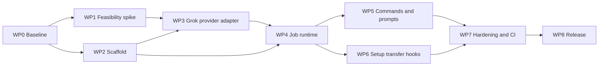

# Grok Companion Implementation Plan

Status: Planning baseline (implementation not started)

Target release: `0.1.0`

Companion specification: [SPEC.md](SPEC.md)

## 1. Objective

Build `grok-plugin` as a Claude Code marketplace plugin that exposes the official Grok Build CLI as a companion coding agent. The target is user-visible parity with [`openai/codex-plugin-cc` v1.0.6](https://github.com/openai/codex-plugin-cc/tree/db52e28f4d9ded852ab3942cea316258ae4ef346), while using Grok-supported runtime interfaces.

Parity means:

- The same eight command families, arguments, foreground/background modes, and output discipline.
- Equivalent review, adversarial review, rescue, transcript transfer, resume, status, result, cancellation, session cleanup, and stop-gate behavior.
- Equivalent read-only and write-capable safety boundaries.
- Equivalent failure transparency: Claude must not silently substitute its own work when Grok fails.
- Provider internals may differ where Grok's ACP interface differs from Codex app-server.

## 2. Verified starting point

- The target GitHub repository was empty when this planning baseline was created.
- The upstream reference is pinned to v1.0.6, commit `db52e28f4d9ded852ab3942cea316258ae4ef346`.
- The pinned upstream repository passes all 91 tests and its build locally.
- The local Grok CLI is 0.2.93; the CLI reported 0.2.99 as the stable update during research.
- ACP initialization on the local CLI advertised protocol v1 and session loading.
- Official Grok commands exist for ACP stdio, headless execution, persistent sessions, cancellation, and Claude-session import.
- No documented Grok native review RPC equivalent to Codex `review/start` was found.
- The public `grok import --json` NDJSON shape is not sufficiently documented to implement without contract fixtures.
- Grok can discover Claude-compatible plugins, making recursive plugin invocation a release-critical risk.

These findings justify the architecture, but they do not replace the executable feasibility gate in WP1.

## 3. Planning assumptions

| ID | Assumption |
|---|---|
| A1 | Claude Code is the host and the official local Grok Build CLI is the delegated agent. |
| A2 | ACP over `grok agent stdio` is the primary provider transport. |
| A3 | Grok headless streaming JSON is a compatibility fallback only. |
| A4 | Node.js 18.18 is the intended minimum unless testing forces a higher version. |
| A5 | This is a community derivative and must not claim OpenAI or xAI endorsement. |
| A6 | Behavioral and safety parity are required; identical internal architecture is not. |
| A7 | Users authenticate the local Grok CLI; the plugin never bundles credentials. |
| A8 | One Grok process per job is acceptable unless measured startup cost is prohibitive. |
| A9 | The first release is `0.1.0`. |
| A10 | Names are repository `grok-plugin`, marketplace `grok-companion`, plugin `grok`, and namespace `/grok:*`. |

If an assumption changes, update both SPEC.md and PLAN.md before implementation continues.

## 4. Architectural decisions

| Decision | Choice | Rationale |
|---|---|---|
| Host packaging | Claude Code marketplace and plugin manifests | Matches the reference host and installation model. |
| Primary transport | ACP v1 over `grok agent stdio` | Official local agent integration with streaming and sessions. |
| Process model | One Grok process per job | Sandboxes are selected at process start and must not cross privilege profiles. |
| Normal review | Versioned plugin-owned read-only prompt | Grok has no documented native review RPC equivalent. |
| Background lifecycle | Plugin-owned persistent job registry | Provider sessions alone do not provide Claude-scoped status/result/cancel behavior. |
| Transcript transfer | Validated `grok import --json` | Uses Grok's native Claude-session import route. |
| Direct xAI API | Excluded from v0.1 | It would require rebuilding the Grok Build tool loop, sandbox, and persistence. |
| Shared broker | Excluded from v0.1 | It adds complexity without removing process-level sandbox boundaries. |
| Upstream incorporation | Copy and adapt selected pinned files into this repository | Keeps this repository's history while preserving Apache provenance explicitly. |

## 5. Delivery sequence



| Work package | Depends on | Estimate | Exit gate |
|---|---|---:|---|
| WP0 — Baseline and provenance | None | 0.5 day | G0 |
| WP1 — ACP, sandbox, import, and recursion spike | WP0 | 1–1.5 days | G1 |
| WP2 — Plugin scaffold and mechanical rebrand | WP0; provider behavior waits for G1 | 0.5–1 day | G2 |
| WP3 — Grok provider adapter | G1, WP2 | 2–2.5 days | G3 |
| WP4 — Job orchestration and persistence | WP2, provider interface from WP3 | 1.5–2 days | G4 |
| WP5 — Commands, prompts, and rescue subagent | WP3, WP4 | 1.5–2 days | G5 |
| WP6 — Setup, transfer, lifecycle, and stop gate | WP3, WP4 | 1–1.5 days | G6 |
| WP7 — Security, compatibility, and CI hardening | WP5, WP6 | 2–2.5 days | G7 |
| WP8 — Documentation and release | G7 | 0.5–1 day | G8 |

Estimated total: **10–14 focused engineer-days** for one engineer. This excludes account delays and major breaking changes in Grok's evolving CLI or ACP implementation.

WP3 and the provider-neutral part of WP4 can overlap after the provider interface is frozen. WP5 and WP6 can run in parallel after G4.

## 6. WP0 — Freeze baseline and provenance

### Tasks

- Record upstream v1.0.6 and commit `db52e28f4d9ded852ab3942cea316258ae4ef346`.
- Add the OpenAI repository as an `openai-upstream` read-only reference remote.
- Re-run the pinned upstream build and 91 tests in a reproducible environment.
- Create `UPSTREAM.md` documenting:
  - Source repository, version, and commit.
  - Copied and materially adapted files.
  - Apache-2.0 provenance.
  - Material changes and non-affiliation.
- Preserve upstream LICENSE and applicable NOTICE content when source is introduced.
- Require a prominent modification notice in every copied-and-modified upstream file and maintain a machine-checkable file inventory in `UPSTREAM.md`.
- Create a parity matrix covering every command, flag, output rule, state transition, hook, and failure mode.
- Centralize package, marketplace, plugin, and version identifiers.
- Decide the implementation commit series before source is copied.

### G0 — Baseline gate

- Upstream tests and build pass.
- Every public reference behavior maps to a target behavior or an explicit divergence.
- License and trademark handling are documented.
- No parity row remains "unknown."

## 7. WP1 — Protocol, sandbox, import, and recursion spike

Build a disposable harness before porting production runtime code.

### ACP tasks

- Spawn Grok directly with an argument array and `shell: false`.
- Initialize ACP and record protocol version, auth methods, model/effort options, session capabilities, and prompt capabilities.
- Verify `grok agent stdio --no-leader` and prove that each job is isolated from any shared Grok leader.
- Exercise session creation, session loading, prompt streaming, stop reasons, cancellation, and unexpected process exit.
- Capture representative agent-message, plan, tool-call, tool-update, usage, error, and unknown events.
- Test Grok 0.2.93 and 0.2.99.
- Set `MIN_GROK_VERSION` only after both contracts are compared.

### Sandbox tasks

- Prove a read-only process cannot change worktree content, executable modes, symlink targets, staged-tree content, or refs.
- Prove a write process can change the workspace and documented Grok-owned runtime paths but not arbitrary sibling, parent, or home-directory canaries.
- Prove the child receives only the explicit environment allowlist; seed unrelated parent variables and verify they are absent from Grok tools and command subprocesses.
- Test environment-key authentication separately. If the key reaches tool subprocesses, disallow that auth mode for tool-using jobs and require cached login.
- Record platform differences, especially macOS child-process network behavior.
- Verify managed-policy denials are detectable and actionable.
- Verify a resumed session cannot change to a less restrictive profile.

### Import tasks

- Run `grok import --json` against controlled Claude transcript fixtures.
- Capture and version synthetic, credential-free NDJSON contract fixtures.
- Determine the reliable imported session ID and resume command.
- Test malformed, missing, duplicate, oversized, and symlinked inputs.
- Establish idempotency behavior, adding a local path-and-content-hash ledger if required.

### Recursion tasks

- Determine which Claude commands, agents, skills, hooks, and marketplaces a child Grok process discovers.
- Set `GROK_COMPANION_CHILD=1` on every provider process.
- Make runtime entry points refuse nested companion execution.
- Make lifecycle hooks no-op in a child.
- Disable subagents for review and stop-gate profiles.
- Add an explicit prompt rule against invoking `/grok:*` or `grok-rescue`.
- Demonstrate that a child cannot create a recursive companion job.

### Fallback tasks

- Probe headless `streaming-json` behavior.
- Document which ACP guarantees can be reproduced exactly.
- Do not enable fallback for an operation whose sandbox, persistence, cancellation, or output guarantees are weaker.

### G1 — Feasibility gate

All of the following must be demonstrated:

- ACP initializes, creates a session, streams a result, cancels, and loads a saved session.
- Review execution leaves the fixture repository unchanged.
- Write execution remains inside the workspace boundary.
- Cancellation leaves no provider or grandchild process.
- Import yields a reliable resumable session ID.
- The recursion guard works end to end.
- A supported version range and fallback policy are recorded.

Failure of review immutability, write confinement, or recursion prevention blocks implementation.

## 8. WP2 — Plugin scaffold and rebrand

### Target tree

```text
.
├── .claude-plugin/marketplace.json
├── .github/workflows/
├── README.md
├── LICENSE
├── NOTICE
├── UPSTREAM.md
├── SPEC.md
├── PLAN.md
├── package.json
├── package-lock.json
├── tsconfig.runtime.json
├── scripts/bump-version.mjs
├── tests/
└── plugins/grok/
    ├── .claude-plugin/plugin.json
    ├── CHANGELOG.md
    ├── LICENSE
    ├── NOTICE
    ├── commands/
    ├── agents/grok-rescue.md
    ├── skills/
    │   ├── grok-cli-runtime/SKILL.md
    │   ├── grok-result-handling/SKILL.md
    │   └── grok-prompting/SKILL.md
    ├── hooks/hooks.json
    ├── prompts/
    ├── schemas/review-output.schema.json
    └── scripts/
        ├── grok-companion.mjs
        ├── session-lifecycle-hook.mjs
        ├── stop-review-gate-hook.mjs
        └── lib/
```

### Tasks

- Copy only required provider-neutral upstream files.
- Rename command namespaces, environment variables, state identifiers, headings, and follow-up commands.
- Remove Codex app-server and broker assumptions.
- Keep provider calls behind an initially unimplemented interface.
- Add one version source and synchronization checks for all manifests and lockfiles.
- Add community and non-affiliation language.
- Add the Apache-2.0 section 4(b) change notice to every modified upstream-derived file.
- Avoid official-looking `@xai`, `xai-*`, OpenAI namespaces, and logos.

### G2 — Scaffold gate

- Claude validates the marketplace and plugin manifests.
- The plugin installs in a clean Claude profile.
- All eight commands and the rescue agent are discoverable.
- Unimplemented provider operations fail explicitly.
- A stale-brand scan finds no unintended user-facing Codex, OpenAI, or GPT identifiers.

## 9. WP3 — Grok provider adapter

### Components

- `acp-client.mjs` — framing, IDs, pending requests, notifications, timeouts, and teardown.
- `grok-provider.mjs` — CLI discovery, version checks, auth, spawning, and session lifecycle.
- `grok-events.mjs` — normalized progress events.
- `execution-profile.mjs` — immutable review, stop, read-only rescue, and write rescue profiles.
- `provider-errors.mjs` — stable error taxonomy.
- `claude-session-transfer.mjs` — import and resume formatting.
- `fake-grok-fixture.mjs` — scripted ACP scenarios.

### Tasks

- Implement the provider interface defined by SPEC.md.
- Separate protocol stdout from diagnostic stderr.
- Launch ACP with `--no-leader` and the startup-only sandbox, permission, web, tool, and subagent flags selected by the execution profile.
- Discover model and effort choices from ACP configuration options.
- Record session IDs immediately.
- Implement provider-session deletion through `grok sessions delete <session-id>` for non-resumable review and stop-gate sessions.
- Preserve unknown protocol events only after recursive key-based and exact-value redaction.
- Redact keys, authorization values, and auth payloads.
- Construct the Grok child environment from the normative allowlist instead of inheriting `process.env`.
- Apply distinct initialization, authentication, prompt, cancellation, and shutdown timeouts.
- Map failures into stable actionable error codes.
- Validate structured output client-side.
- Allow one same-session schema repair attempt.
- Reject resume when the requested execution profile differs from the stored profile.
- Use headless fallback only for contracts proven in WP1.

### G3 — Provider gate

Using the fake provider and an opt-in real CLI test:

- Initialize, authenticate, create, load, prompt, stream, cancel, and shut down.
- Cover every normalized event type.
- Handle malformed frames, unknown events, auth expiry, timeout, and abrupt exit.
- Prove schema repair succeeds once and then fails deterministically.
- Prove no plugin-managed authentication fixture or seeded secret sentinel appears in logs or snapshots.
- Prove resume cannot weaken privileges.

## 10. WP4 — Job orchestration and persistence

### Tasks

- Port provider-neutral argument, Git, filesystem, rendering, process, state, and workspace modules.
- Implement the state schema and path from SPEC.md.
- Use atomic writes and a bounded lock with stale-lock recovery.
- Use `0700` directories and `0600` sensitive files where supported.
- Retain at most 50 jobs without evicting active jobs.
- Implement `queued`, `running`, `completed`, `failed`, and `cancelled` transitions.
- Persist workspace, Claude session, Grok session, the complete effective security profile, model, effort, verified process identities, timestamps, result, and stable error.
- Convert stale active records to `E_WORKER_LOST` during recovery.
- Implement current-session implicit lookup and repository-scoped explicit IDs.
- Detach background workers safely.
- Clear full prompts from persisted requests after the worker claims them; never replay a lost worker automatically.
- Implement cancellation marker, ACP cancellation, bounded wait, and process-tree termination.
- Bind worker and provider PIDs to start tokens, a 128-bit nonce, and a job-specific command marker; never signal an unverified reused PID.
- Verify touched files using provider events and before/after repository state.

### G4 — Runtime gate

- Foreground and background jobs reach correct terminal states.
- Concurrent writers do not corrupt or lose jobs.
- Status, result, wait, and cancel work from a new command process.
- Implicit lookup never selects another Claude session's job.
- Crash recovery leaves no phantom running job.
- Cancellation kills a provider's spawned grandchild.
- A simulated PID-reuse mismatch produces `E_PROCESS_IDENTITY` and never signals the unrelated process.
- Retention remains bounded without deleting active work.

## 11. WP5 — Commands, prompts, and rescue subagent

### Tasks

- Implement all eight command Markdown files.
- Preserve the reference syntax and argument meanings.
- Keep command wrappers deterministic and thin.
- Route `/grok:rescue` through `grok:grok-rescue`.
- Restrict the rescue subagent to one companion invocation and verbatim forwarding.
- Prevent Claude from completing a task itself after Grok fails.
- Port working-tree, branch, and auto review target selection.
- Handle staged, unstaged, untracked, binary, renamed, large, symlinked, and hostile-path cases.
- Implement deterministic `--resume` and `--fresh` selection.
- Replace GPT-specific guidance with a Grok-specific prompting skill.
- Add versioned normal-review, adversarial-review, and stop-gate prompts.
- Implement the structured review schema and deterministic renderer.
- Add prompt-injection resistance language treating repository content as evidence.

### G5 — Command parity gate

- Every parity-matrix row has a passing contract test.
- All eight commands follow their stdout, stderr, and exit rules.
- Foreground/background and resume/fresh modes are covered.
- Review target selection matches the reference.
- Routing cannot cause a second provider invocation.
- Grok failure is surfaced without a Claude fallback.

## 12. WP6 — Setup, transfer, lifecycle, and stop gate

### Setup tasks

- Check Node, Git, Grok binary, and Grok version.
- Initialize ACP and inspect auth, session loading, model/effort options, and sandbox compatibility.
- Distinguish missing CLI, unsupported version, expired auth, capability loss, and managed-policy denial.
- Offer the exact `npm install -g @xai-official/grok` command only after explicit approval; document the official curl installer as a manual alternative.
- Provide official login guidance without requesting or printing a key.

### Transfer tasks

- Default to the SessionStart transcript path and allow `--source` override.
- Require a real regular `.jsonl` beneath the real `~/.claude/projects` directory.
- Reject traversal, symlink escape, non-file input, and unexpected extensions.
- Hash the source for duplicate detection.
- Invoke `grok import --json` directly.
- Parse conservatively and retain only redacted NDJSON diagnostics.
- Return `grok --resume <session-id>`.
- Fail explicitly if no reliable session ID exists.

### Lifecycle tasks

- SessionStart exports the Claude session ID, transcript path, and plugin data path.
- SessionEnd cancels only active jobs owned by that Claude session.
- SessionEnd removes records and artifacts for the ending Claude session after bounded cleanup, without touching other sessions.
- Hooks no-op when `GROK_COMPANION_CHILD=1`.

### Stop-gate tasks

- Keep the gate disabled by default.
- Scope the prompt with the Stop hook's immediately preceding assistant message, let Grok determine whether it claims edits, and document that current repository state cannot be cryptographically attributed to one turn without a historical snapshot.
- Use a separate read-only Grok process.
- Enforce the 15-minute timeout.
- Require first-line `ALLOW:` or `BLOCK:`.
- Preserve fail-open behavior for completely unavailable Grok, with setup guidance.
- Block malformed output, runtime failure, and timeout when Grok is available and the gate is enabled.
- Warn about another active task without recursively starting work.

### G6 — Lifecycle gate

- Setup diagnoses each supported failure category.
- Transfer returns a session loadable in a new Grok process.
- Invalid and escaped transcript paths are rejected.
- SessionEnd kills only current-session jobs and leaves no orphan.
- All stop-gate allow, block, malformed, timeout, missing-runtime, and active-job cases match the contract.
- Child Grok processes cannot trigger lifecycle recursion.

## 13. WP7 — Test, security, and compatibility hardening

### Unit coverage

- Arguments, version comparison, model/effort validation.
- Git target and diff-context selection.
- Workspace canonicalization and hashing.
- State transitions, migration, rendering, retention, and locking.
- ACP framing and request correlation.
- Event normalization and auth selection.
- Import parsing and schema validation.
- Version synchronization.

### Fake-provider integration coverage

- Initialize/authenticate/session-new/session-load/prompt.
- Message, plan, tool, usage, and unknown events.
- Partial and malformed protocol data.
- Authentication expiry, timeout, and crash.
- ACP cancellation completion or cancelled stop reason, followed by forced process-tree termination when neither arrives.
- Structured-output repair.
- Read/write profile arguments.
- Resume profile mismatch.
- Spawned grandchildren and cleanup.

### Command contract coverage

- Every command and supported flag combination.
- Human slash-command output and corresponding internal runtime `--json` payloads; `--json` is not a public slash-command flag in v0.1.
- Exact hook-consumed first lines and exit behavior.
- Background start, status, wait, result, and cancel.
- Resume candidate selection and ambiguity.
- Failure rendering without accidental fallback.

### Security coverage

- Read-only ref, semantic index tree, staged/unstaged binary diff, mode, symlink, and untracked-content fingerprints, plus ignored-file canaries.
- Write confinement using sibling, parent, and home canaries outside documented Grok-owned runtime paths.
- Shell metacharacters in paths, refs, prompts, and IDs.
- Transcript and state path traversal.
- Concurrent state corruption.
- Cross-Claude-session access.
- PID reuse and forged process-identity records.
- Plugin-managed authentication fixtures and seeded secret sentinels absent from state, logs, stdout, stderr, and snapshots.
- Repository prompt injection cannot obtain write tools during review.
- Recursion guard across runtime, agents, skills, and hooks.

### Platform and CI matrix

- Ubuntu: Node 18.18 and Node 22.
- macOS: Node 22.
- Windows: Node 22.
- `npm ci`.
- Unit and fake-provider tests.
- Build and type checks.
- Claude plugin validation.
- License and NOTICE validation.
- Upstream-derived file inventory and per-file modification-notice validation.
- Version synchronization and stale-brand checks.
- Secret scanning.
- Optional manually dispatched real-Grok workflow.

Real Grok tests MUST NOT run on normal pull requests because they consume credentials and quota.

Before release, run the protected `GROK_E2E=1` sandbox, cancellation, resume, and recursion subset on Linux, macOS, and Windows. Commit non-secret result metadata containing OS, Grok version, date, and outcome. Any platform without passing evidence must be documented as unverified and excluded from the supported-platform claim.

### G7 — Release-candidate gate

- All mapped upstream tests pass or have documented replacements.
- Every parity row and security invariant has a passing test.
- Linux, macOS, and Windows CI is green.
- Real release-candidate isolation evidence exists for every platform claimed as supported.
- Immutability, confinement, cleanup, recursion prevention, and redaction pass.
- Regular CI requires no paid-provider credential.
- No unexplained provider-specific skip remains.

## 14. WP8 — Documentation and release

### Documentation tasks

- Complete installation and authentication instructions.
- Document every command and flag.
- Add foreground/background, resume, transfer, and cancellation examples.
- Document state and log locations plus cleanup.
- Document Grok's independent `~/.grok/sessions` store and the `grok sessions list/delete` cleanup flow.
- Disclose that prompts, selected repository content, command output, and imported Claude context may be processed through Grok/xAI services despite the local CLI transport.
- Explain read-only versus write profiles and managed-policy limitations.
- Document the macOS child-network caveat.
- Document stable error codes and troubleshooting.
- Publish the tested Grok compatibility range.
- Explain that normal review is plugin-prompt-based, not a native review RPC.
- Add Apache provenance, modification notices, and non-affiliation language.
- Add upgrade and rollback instructions.

### Release tasks

- Validate from a clean Claude profile.
- Install from `xliberty2008x/grok-plugin` and run `/grok:setup`.
- Run the opt-in live smoke suite.
- Synchronize all versions to `0.1.0`.
- Check package contents for secrets, local state, and temporary fixtures.
- Update `CHANGELOG.md`.
- Tag `v0.1.0` only after every release gate passes.
- Record exact Node, Claude Code, and Grok versions used for validation.

### G8 — Release gate

- Clean-profile install and setup succeed.
- All eight commands are discoverable.
- Read-only review, write rescue, background lifecycle, cancellation, resume, transfer, and stop-gate smoke tests pass.
- Attribution and non-affiliation notices are present.
- Every modified upstream-derived file has its required prominent change notice.
- Versions are synchronized.
- Known limitations are documented.
- External processing and both plugin/provider data-retention boundaries are disclosed before first use.
- No release-blocking risk remains open.

## 15. Commit strategy

Keep implementation reviewable and bisectable:

1. `docs: add Grok companion specification and implementation plan`
2. `test: add Grok ACP and sandbox contract spike`
3. `chore: scaffold Claude Code Grok plugin`
4. `feat: add Grok ACP provider adapter`
5. `feat: port persistent companion job runtime`
6. `feat: add Grok commands prompts and rescue agent`
7. `feat: add setup transfer and lifecycle hooks`
8. `test: harden security lifecycle and platform coverage`
9. `docs: prepare Grok companion v0.1.0 release`

Implementation SHOULD occur on `codex/grok-port` and merge into `main` only after G7. Each commit must keep tests passing or isolate an explicitly non-production spike.

## 16. Risk register

| ID | Risk | Likelihood | Impact | Mitigation | Gate |
|---|---|---:|---:|---|---|
| R1 | ACP or CLI schema changes between Grok versions | High | High | Capability negotiation, redacted unknown-event preservation, oldest/current contract tests | G1, G3, G7 |
| R2 | Prompt-based review is weaker than native Codex review | Medium | High | Versioned prompts, structured findings, fixed evaluation repositories, golden expected findings | G5, G7 |
| R3 | Child Grok discovers and recursively invokes the plugin | High | Critical | Child marker, runtime refusal, hook no-op, prompt rule, disabled review subagents | G1 |
| R4 | Sandbox behavior differs by platform | Medium | Critical | Process profiles, tool denial, workspace fingerprints, canaries, documented caveats | G1, G7 |
| R5 | `grok import --json` changes or omits a usable session ID | High | High | Raw fixtures, conservative parser, explicit ID requirement, version tests | G1, G6 |
| R6 | Managed policy prevents unattended write tasks | Medium | Medium | Setup detection, policy-respecting failure, read-only alternative | G6 |
| R7 | Cancelled or crashed jobs leave orphan processes | Medium | High | ACP cancel, bounded wait, process-tree kill, SessionEnd cleanup | G4, G7 |
| R8 | Concurrent commands corrupt persistent state | Medium | High | Atomic writes, locks, stale recovery, idempotent terminal transitions | G4 |
| R9 | Secrets leak through environment or provider events | Medium | Critical | Redaction boundary, no raw persistence by default, file permissions, fake secret fixtures, secret scan | G3, G7 |
| R10 | Copied source loses attribution or implies endorsement | Low | High | Preserve Apache LICENSE/NOTICE, UPSTREAM.md, modification markers, disclaimer | G0, G8 |
| R11 | Windows quoting and cleanup differ from POSIX | Medium | Medium | No shell, platform abstraction, Windows CI, process-tree fixtures | G7 |
| R12 | Real-provider tests are costly or flaky | High | Medium | Fake ACP suite in PR CI; minimal opt-in live smoke tests | G7 |
| R13 | Structured review output is malformed | Medium | Medium | JSON Schema, one repair turn, deterministic failure | G3, G5 |
| R14 | Repository prompt-injects the reviewer | Medium | High | Read-only boundary, tool denial, no review subagents/web, untrusted-content instruction | G7 |
| R15 | Resume attempts to change privilege profile | Medium | High | Persist profile, reject mismatch, require fresh session | G3, G5 |
| R16 | Per-job startup is too slow | Medium | Low | Benchmark in WP1; consider profile-separated pooling only after v0.1 | G1 |
| R17 | Version fields drift across manifests | Medium | Medium | One source, bump script, CI synchronization test | G2, G8 |

## 17. Explicit non-goals for v0.1

- Reimplementing Grok Build over the direct xAI API.
- A long-lived shared Grok broker.
- Automatic privilege escalation or managed-policy bypass.
- Silent fallback from Grok to Claude.
- Cross-workspace implicit resume.
- Automatic installation of credentials.
- Publishing under an xAI- or OpenAI-owned namespace.
- Guaranteeing identical review wording or hidden reasoning; parity covers behavior, safety, and result contracts.

## 18. Definition of done

The first release is complete only when:

- All eight `/grok:*` commands work with documented flags.
- Review jobs leave the repository unchanged.
- User-project changes from rescue jobs remain inside the intended workspace; only documented Grok-owned runtime writes are allowed outside it.
- Background status, result, wait, cancellation, and crash recovery work across command processes.
- Resume selects only an eligible Grok session for the canonical repository and Claude session.
- Transfer yields a valid resumable Grok session.
- Stop-gate output and failure behavior match the reference.
- Models and effort values are capability-driven.
- Child Grok processes cannot recursively invoke the plugin.
- Plugin-managed authentication material and seeded secret sentinels never enter state, logs, results, or snapshots.
- SessionEnd cleans only the current Claude session's work.
- Installation and validation succeed from a clean profile.
- Versions and attribution are synchronized.
- Linux, macOS, and Windows CI is green.
