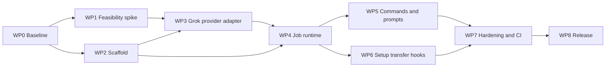

# Grok Companion Implementation Plan

Status: Unqualified hardening candidate on the current branch; not a release-ready build

Target release: `0.3.0`

Companion specification: [SPEC.md](SPEC.md)

## 1. Objective

Harden and qualify `grok-plugin` as a dual-host Claude Code and Codex marketplace plugin that exposes the official Grok Build CLI as a companion coding agent. The implemented target is user-visible parity with [`openai/codex-plugin-cc` v1.0.6](https://github.com/openai/codex-plugin-cc/tree/db52e28f4d9ded852ab3942cea316258ae4ef346), while using Grok-supported runtime interfaces and a host control plane for rescue.

Parity means:

- The same eight command families, arguments, foreground/background modes, and output discipline.
- Equivalent review, adversarial review, rescue, transcript transfer, resume, status, result, cancellation, session cleanup, and stop-gate behavior.
- Equivalent read-only and write-capable safety boundaries under strict sandboxing.
- Equivalent failure transparency: neither host may silently substitute its own work when Grok fails.
- Provider internals differ intentionally: reviews use headless Grok, resumable tasks use ACP v1, transfer uses `grok import --json`, and rescue uses TaskEnvelope v1 plus host-owned verification rather than verbatim host-stdout forwarding.

## 2. Verified current state

- The repository contains the marketplace, plugin, runtime, hooks, prompts, schema, tests, validation scripts, provenance, and release documentation.
- Dual-host packaging includes a Codex marketplace and manifest, eight `$grok:*` skills, a Codex wrapper, host identity, cross-host job isolation, shared Codex-compatible hooks, and a privacy-filtered Codex rollout converter.
- The upstream reference is pinned to v1.0.6, commit `db52e28f4d9ded852ab3942cea316258ae4ef346`.
- The pinned upstream repository passed all 91 tests and its build when the baseline was frozen.
- The runtime enforces Grok Build 0.2.99 as the compatibility floor because the hardened ACP path depends on `--agent-profile`, `agent --no-leader`, and `--leader-socket`.
- **Hardening slice implemented in this worktree (documentation now aligned):**
  - TaskEnvelope v1 and ContextManifest v1, including runtime-verified exact `context.requiredPaths` for task-scoped checkout inventory.
  - Schema-3 jobs with progress, heartbeat, lifecycle events, completion manifests, and public JSON projection.
  - Profile contract v3 with `rescue-read-v3`, `rescue-write-v3`, and zero-tool `rescue-report-v3`.
  - Strict sandbox for reviews and rescue; no workspace or bypass write sandbox.
  - Write tools limited to `read_file`, `list_dir`, `grep`, `search_replace`, and `todo_write` (no terminal, kill_task, or get_task_output).
  - One workspace writer at a time; read-only jobs may overlap only when no writer is active.
  - Exact completion- or recorded-verification-manifest resume for schema-3 jobs; explicit `--job-id` preferred.
  - Host-scoped explicit job ID access for status/result/cancel whenever either caller or record is session-scoped; hostless callers cannot access session-owned jobs.
  - Structured write input via `--envelope-stdin` or private `--envelope-file`.
  - Per-lineage task homes under `task-homes/<providerHomeId>/` (not shared mode homes).
  - Cached credential staged for session auth, then removed before `session/prompt`.
  - Final `GROK_WORKER_REPORT` validation; runtime evidence separated from provider claims; `hostVerification` remains `not_run` in the Grok runtime.
  - One-shot host-owned command verification for declared `requiredVerification`, recorded as a scoped `host_asserted` checkpoint under workspace admission.
  - Native-like fix-and-reverify continuations: failed host checks return bounded redacted evidence through the exact prior `--job-id` under the same profile and lineage.
- Headless reviews receive their prompt through an anonymous, immediately unlinked file descriptor inherited as fd 3.
- Transcript transfer freezes the validated source into an anonymous point-in-time snapshot inherited as fd 3, with bounded output, cancellation, and whole-process-group cleanup.
- Normal, adversarial, and stop reviews use headless `explore`; read/write rescue tasks use ACP; transfer uses `grok import --json`.
- Tool-using jobs require cached authentication created by `grok login`; environment-key-only authentication is unsupported. Near-expiry credentials refresh before isolated staging.
- SessionEnd verifies complete owned worker/provider process groups before removing records or guards; unverifiable cleanup records `E_PROCESS_IDENTITY` and retains state.
- Same-lineage admission includes terminal tasks whose transient cleanup is pending. Recovery holds the admission lock while removing lineage auth/profile artifacts, defers to an active continuation, retries cleanup-blocked verified process termination, and restores the intended terminal outcome only after cleanup succeeds.
- Linux provider execution remains authenticated-provider-unverified. Windows runs provider-neutral tests only; provider execution and process control are unsupported in v0.3.

### Evidence and qualification status

- The authenticated macOS 10/10 matrix with Grok Build 0.2.99 on July 13, 2026 is retained under `tests/e2e-results/` as **historical** evidence for an earlier contract (profile contract v2, terminal-capable write profile, shared mode homes, pre-TaskEnvelope control plane). It does **not** qualify the current hardened worktree.
- On July 14, 2026, the current worktree passed the opt-in authenticated direct-runtime suite for setup, review, read/write TaskEnvelope jobs, stop gate, same-lineage resume, capability denial, and transcript transfer; the opt-in cancellation case passed separately. This is current implementation evidence, but it is not a recorded installed-host release qualification.
- On July 14, 2026, the locally installed Codex snapshot also passed a real-provider development probe with Grok Build 0.2.101: the delayed issue #2 task completed, the installed result renderer succeeded, and three independent issue #5 read jobs overlapped and completed with `taskRuntimeCleaned: true`, `hostVerification: passed`, and no runtime-observed workspace changes. The deterministic suite now repeats the three-job concurrency/profile lifecycle and bounded diagnostic contract.
- A fresh natural `codex exec` loaded the installed skill but hit the account usage limit before it could dispatch Grok. Authenticated installed-Codex **natural host orchestration** has therefore not passed for this hardening slice; the direct installed-wrapper evidence cannot be promoted across that boundary.
- This branch is therefore an **unqualified hardening candidate**, not a release-ready build.

### Residual limitations (document honestly)

1. **macOS child-network isolation** is not enforced by Grok; the plugin does not claim otherwise.
2. **Writes are native-like in-place** via `search_replace`. Scope violations are detected **after** mutation (`E_SCOPE_VIOLATION`) and are not rolled back by the runtime.
3. **Authenticated installed-Codex natural host-orchestration E2E** for this hardening slice remains outstanding; direct installed-wrapper execution has passed but is a different evidence boundary.
4. Cross-platform authenticated provider qualification beyond historical macOS evidence remains open.

Remaining release work: run and record authenticated installed-Codex natural-flow E2E, record release-candidate evidence for the direct runtime, obtain provider-neutral CI on the declared OS/Node matrix, keep Linux provider-unverified and Windows provider-unsupported until evidence exists, perform clean-profile marketplace installs, and only then decide whether to promote `0.3.0-dev.1` to a release candidate.

Promotion evidence is an aggregate dual-host record bound to a deterministic
source inventory digest. The record itself is excluded from that digest to
avoid a self-referential commit; any other tracked or non-ignored untracked
change invalidates the evidence. Both Codex and Claude Code must independently
cross the stage-required boundaries before the dual-host package can be called
an RC or stable release.

## 3. Planning assumptions

| ID | Assumption |
|---|---|
| A1 | Claude Code or Codex is the host and the official local Grok Build CLI is the delegated agent. |
| A2 | Headless `explore` is the review transport; ACP over `grok agent --no-leader --leader-socket <path> --agent-profile <profile> stdio` is the resumable task transport. |
| A3 | Transport is profile-fixed before execution; there is no automatic headless/ACP fallback. |
| A4 | Node.js 18.18 is the intended minimum unless testing forces a higher version. |
| A5 | This is a community derivative and must not claim OpenAI or xAI endorsement. |
| A6 | Behavioral and safety parity are required; identical internal architecture is not. |
| A7 | Users authenticate with a cached `grok login`; environment-key-only authentication is unsupported and the plugin never bundles credentials. |
| A8 | One Grok process per job, `agent --no-leader`, and a unique `--leader-socket` preserve profile isolation. |
| A9 | The current hardening line targets `0.3.0`; development and release-candidate prereleases remain unqualified until the release gates pass. |
| A10 | Names are repository `grok-plugin`, marketplace `grok-companion`, plugin `grok`, Claude namespace `/grok:*`, and Codex skill namespace `$grok:*`. |
| A11 | Rescue is a host control plane with TaskEnvelope v1, explicit job IDs, and host-owned verification—not a verbatim provider-stdout forward path. |
| A12 | Write workers have no terminal; required checks are host-owned. |

If an assumption changes, update both SPEC.md and PLAN.md before implementation continues.

## 4. Architectural decisions

| Decision | Choice | Rationale |
|---|---|---|
| Host packaging | Native Claude Code and Codex marketplace/plugin manifests | Keeps each host's discovery and installation model while sharing one runtime. |
| Review transport | Headless `explore`, anonymous fd 3 prompt input, JSON/JSON-Schema output | Grok has no documented native review RPC; the immediately unlinked descriptor avoids leaving a named prompt on disk. |
| Task transport | ACP v1 over `grok agent --no-leader --leader-socket <path> --agent-profile <profile> stdio` | Provides streamed progress and session loading while binding each rescue mode to a checked-in profile and isolated process. |
| Transport fallback | None | Retrying through another transport could duplicate side effects or weaken a security contract. |
| Process model | One Grok process per job | Sandboxes are selected at process start and must not cross privilege profiles. |
| Leader isolation | `agent --no-leader` plus a unique `--leader-socket` per ACP process | Prevents jobs from joining a shared Grok leader and keeps leader IPC paths job-scoped. |
| Sandbox | Strict for reviews and rescue; isolated custom profiles extend `strict` | Avoids workspace/bypass sandboxes; network restriction and Git-metadata denies apply to task homes. |
| Task identity | Contract-version-3 checked-in read/write `toolConfig` profiles, persisted `agentProfileDigest`, per-lineage homes, pre-prompt credential revocation | Makes the exact tool boundary auditable, binds resume to unchanged profile contents, and prevents cross-lineage configuration or credential reuse during tool use. |
| Write tools | `read_file`, `list_dir`, `grep`, `search_replace`, `todo_write` only | Host owns command execution; provider `checksClaimed` remain claims. |
| Rescue contract | TaskEnvelope v1 + ContextManifest v1 + schema-3 jobs + `GROK_WORKER_REPORT` | Separates host intent, workspace identity, provider claims, and runtime evidence. |
| Workspace concurrency | One active writer; no overlapping writers or read/write mixtures | Attributable diffs for post-mutation scope and evidence. |
| Resume | Exact completion- or recorded-verification-manifest compatibility; explicit `--job-id` | Prevents continuing in a drifted checkout while allowing one scope-checked, host-asserted post-check snapshot to become the next exact baseline. |
| Public status | Public JSON projection with progress/heartbeat | Hosts monitor without reading private process or prompt fields. |
| Explicit ID access | Exact host/session match whenever either side is scoped | Prevents cross-host-session leakage and hostless access through repository-resident IDs. |
| Transcript transfer | Claude and filtered Codex sources are frozen into immediately unlinked point-in-time descriptors after canonical post-open validation | Uses Grok's native Claude-session import route without importing concurrent host appends, persisting host transcripts, or exposing hidden Codex records. |
| Direct xAI API | Excluded from v0.3 | It would require rebuilding the Grok Build tool loop, sandbox, and persistence. |
| Shared broker | Excluded from v0.3 | It adds complexity without removing process-level sandbox boundaries. |
| Upstream incorporation | Copy and adapt selected pinned files into this repository | Keeps this repository's history while preserving Apache provenance explicitly. |

## 5. Delivery sequence



| Work package | Depends on | Original estimate | Current status | Exit gate |
|---|---|---:|---|---|
| WP0 — Baseline and provenance | None | 0.5 day | Complete | G0 |
| WP1 — ACP, sandbox, import, and recursion spike | WP0 | 1–1.5 days | Current macOS direct-runtime live suite passed; installed-host qualification remains open | G1 |
| WP2 — Plugin scaffold and mechanical rebrand | WP0 | 0.5–1 day | Complete | G2 |
| WP3 — Grok provider adapter | G1, WP2 | 2–2.5 days | Implemented including v3 profiles and credential revocation | G3 |
| WP4 — Job orchestration and persistence | WP2, WP3 | 1.5–2 days | Implemented as schema-3 + one-writer + public projection | G4 |
| WP5 — Commands, prompts, and rescue control plane | WP3, WP4 | 1.5–2 days | Implemented TaskEnvelope control plane | G5 |
| WP6 — Setup, transfer, lifecycle, and stop gate | WP3, WP4 | 1–1.5 days | Implemented; release qualification open | G6 |
| WP7 — Security, compatibility, and CI hardening | WP5, WP6 | 2–2.5 days | Offline and authenticated direct-runtime checks passed locally; installed-Codex and recorded cross-platform qualification remain open | G7 |
| WP8 — Documentation and release | G7 | 0.5–1 day | Normative docs aligned to implementation; release tagging blocked | G8 |

The original planning estimate was **10–14 focused engineer-days** for one engineer. Remaining effort is driven by re-qualification of this hardening slice and authenticated platform evidence rather than the original scaffold estimate.

WP3 and the provider-neutral part of WP4 can overlap after the provider interface is frozen. WP5 and WP6 can run in parallel after G4.

## 6. WP0 — Freeze baseline and provenance

### Tasks

- Record upstream v1.0.6 and commit `db52e28f4d9ded852ab3942cea316258ae4ef346`.
- Add the OpenAI repository as an `openai-upstream` read-only reference remote.
- Re-run the pinned upstream build and 91 tests in a reproducible environment.
- Create `UPSTREAM.md` documenting:
  - Source repository, version, and commit.
  - Copied and materially adapted files.
  - Apache-2.0 provenance.
  - Material changes and non-affiliation.
- Preserve upstream LICENSE and applicable NOTICE content when source is introduced.
- Require a prominent modification notice in every copied-and-modified upstream file and maintain a machine-checkable file inventory in `UPSTREAM.md`.
- Create a parity matrix covering every command, flag, output rule, state transition, hook, and failure mode.
- Centralize package, marketplace, plugin, and version identifiers.
- Decide the implementation commit series before source is copied.

### G0 — Baseline gate

- Upstream tests and build pass.
- Every public reference behavior maps to a target behavior or an explicit divergence.
- License and trademark handling are documented.
- No parity row remains "unknown."

## 7. WP1 — Protocol, sandbox, import, and recursion spike

Build a disposable harness before porting production runtime code.

### ACP tasks

- Spawn Grok directly with an argument array and `shell: false`.
- Initialize ACP and record protocol version, auth methods, model/effort options, session capabilities, and prompt capabilities.
- Verify ACP with `grok agent --no-leader --leader-socket <unique-path> --agent-profile <checked-in-profile> stdio` and prove that each job is isolated from any shared Grok leader.
- Verify contract version 3 records and rechecks the checked-in profile's SHA-256 `agentProfileDigest`, and that resume rejects any digest change.
- Verify the exact `injectDefaultTools: false` profiles: read exposes only `GrokBuild:read_file`, `GrokBuild:list_dir`, and `GrokBuild:grep`; write exposes those three plus `GrokBuild:search_replace` and `GrokBuild:todo_write` with **no** terminal tools.
- Exercise session creation, session loading, prompt streaming, stop reasons, cancellation, unexpected process exit, and pre-prompt credential revocation.
- Capture representative agent-message, plan, tool-call, tool-update, usage, error, and unknown events.
- Keep 0.2.99 as the enforced compatibility floor and distinguish it from authenticated platform evidence for the code under test.
- Treat the July 13, 2026 authenticated macOS 0.2.99 10/10 result as historical only. The July 14 direct-runtime pass is evidence for the changed code, but do not claim the hardening slice is qualified until installed-host and release-recording gates pass.

### Sandbox tasks

- Prove a read-only process cannot change worktree content, executable modes, symlink targets, staged-tree content, or refs.
- Prove a write process can change the workspace through `search_replace` under strict sandbox and documented Grok-owned runtime paths but not arbitrary sibling, parent, or home-directory canaries.
- Prove post-mutation scope evaluation detects out-of-scope writes without claiming rollback.
- Prove the child receives only the explicit environment allowlist; seed unrelated parent variables and verify they are absent from Grok tools and command subprocesses.
- Require cached `grok login` authentication and prove environment-key-only authentication is absent from Grok and tool subprocesses.
- Record platform differences, especially that macOS child-process network isolation is not enforced by Grok.
- Verify managed-policy denials are detectable and actionable.
- Verify a resumed session cannot change to a less restrictive profile.

### Import tasks

- Run `grok import --json` against controlled Claude transcript fixtures.
- Capture and version synthetic, credential-free NDJSON contract fixtures.
- Determine the reliable imported session ID and resume command.
- Test malformed, missing, duplicate, oversized, and symlinked inputs.
- Establish idempotency behavior, adding a local path-and-content-hash ledger if required.

### Recursion tasks

- Determine which Claude commands, agents, skills, hooks, and marketplaces a child Grok process discovers.
- Permit builtin capabilities and provider-bundled skills only when their real paths remain beneath either `<isolated GROK_HOME>/skills/` or `<isolated GROK_HOME>/bundled/skills/`; reject external hooks, skills, plugins, MCP servers, and non-builtin agents.
- Set `GROK_COMPANION_CHILD=1` on every provider process.
- Make runtime entry points refuse nested companion execution.
- Make lifecycle hooks no-op in a child.
- Disable subagents for review and stop-gate profiles.
- Add an explicit prompt rule against invoking `/grok:*`, `$grok:*`, or `grok-rescue`.
- Demonstrate that a child cannot create a recursive companion job.

### Headless review tasks

- Exercise headless `explore` with an anonymous, immediately unlinked prompt descriptor inherited as fd 3, JSON/JSON-Schema output, explicit session IDs, one same-session repair, cancellation, and isolated-home cleanup.
- Verify that normal, adversarial, and stop reviews never fall back to ACP.
- Verify that ACP write tasks are never replayed through headless mode.

### G1 — Feasibility gate

All of the following must be demonstrated **for the code under test**:

- ACP initializes, creates a session, streams a result, cancels, and loads a saved session.
- Review execution leaves the fixture repository unchanged.
- Write execution remains inside the workspace boundary under the no-terminal strict profile.
- Cancellation leaves no provider or grandchild process.
- Import yields a reliable resumable session ID.
- The recursion guard works end to end.
- The 0.2.99 compatibility floor, exact authenticated version evidence, and no-fallback policy are recorded separately.

Failure of review immutability, write confinement, or recursion prevention blocks implementation.

## 8. WP2 — Plugin scaffold and rebrand

### Target tree

```text
.
├── .claude-plugin/marketplace.json
├── .github/workflows/
├── README.md
├── LICENSE
├── NOTICE
├── UPSTREAM.md
├── SPEC.md
├── PLAN.md
├── package.json
├── package-lock.json
├── scripts/validate.mjs
├── scripts/bump-version.mjs
├── tests/
└── plugins/grok/
    ├── .claude-plugin/plugin.json
    ├── CHANGELOG.md
    ├── LICENSE
    ├── NOTICE
    ├── commands/
    ├── agents/grok-rescue.md
    ├── provider-agents/
    │   ├── rescue-read.md
    │   └── rescue-write.md
    ├── skills/
    │   ├── grok-cli-runtime/SKILL.md
    │   ├── grok-result-handling/SKILL.md
    │   └── grok-prompting/SKILL.md
    ├── hooks/hooks.json
    ├── prompts/
    ├── schemas/review-output.schema.json
    └── scripts/
        ├── grok-companion.mjs
        ├── session-lifecycle-hook.mjs
        ├── stop-review-gate-hook.mjs
        └── lib/
            └── task-contract.mjs
```

### Tasks

- Copy only required provider-neutral upstream files.
- Rename command namespaces, environment variables, state identifiers, headings, and follow-up commands.
- Remove Codex app-server and broker assumptions.
- Keep provider calls behind an initially unimplemented interface.
- Add one version source and synchronization checks for all manifests and lockfiles.
- Add community and non-affiliation language.
- Add the Apache-2.0 section 4(b) change notice to every modified upstream-derived file.
- Avoid official-looking `@xai`, `xai-*`, OpenAI namespaces, and logos.

### G2 — Scaffold gate

- Claude validates the marketplace and plugin manifests.
- The plugin installs in a clean Claude profile.
- All eight commands and the rescue agent are discoverable.
- Unimplemented provider operations fail explicitly.
- A stale-brand scan finds no unintended user-facing Codex, OpenAI, or GPT identifiers.

## 9. WP3 — Grok provider adapter

### Components

- `acp-client.mjs` — framing, IDs, pending requests, notifications, timeouts, and teardown.
- `grok-provider.mjs` — CLI discovery, version checks, isolated headless reviews, ACP tasks, authentication staging/revocation, spawning, schema validation, and lifecycle.
- `profiles.mjs` — review, stop, read-only rescue, and write rescue contracts (contract version 3).
- `provider-agents/rescue-read.md` and `provider-agents/rescue-write.md` — checked-in ACP tool and permission profiles.
- `process-control.mjs` and `recursion-guard.mjs` — bounded whole-process-group teardown and nested-invocation prevention.
- `redact.mjs` and `errors.mjs` — redaction and stable error taxonomy.
- `task-contract.mjs` — TaskEnvelope, ContextManifest, worker report, runtime evidence, scope evaluation.
- `grok-companion.mjs` — task orchestration, public projection, transcript import, and session-bound resume formatting.
- `tests/fake-grok.mjs` — scripted headless, ACP, models, sessions, and import scenarios.

### Tasks

- Implement the provider interface defined by SPEC.md.
- Separate protocol stdout from diagnostic stderr.
- Launch every ACP provider process with `agent --no-leader`, a unique `--leader-socket`, the matching checked-in `--agent-profile`, and the startup-only sandbox, permission, web, MCP, memory, planning, and subagent flags selected by the execution profile. Use contract version 3, persist the profile's SHA-256 `agentProfileDigest`, and verify it immediately before spawn.
- Keep `injectDefaultTools: false` and the exact no-terminal `GrokBuild:*` `toolConfig` allowlists.
- Use headless `explore` plus JSON/JSON-Schema output for reviews and ACP v1 for rescue tasks; pass headless prompts only through an anonymous, immediately unlinked fd 3 descriptor.
- Discover model and effort choices from ACP configuration options.
- Record session IDs immediately.
- Isolate review sessions beneath per-job homes and ACP tasks beneath per-lineage homes; remove ephemeral review homes recursively instead of deleting from the user's normal Grok session store.
- Require cached `grok login` authentication and reject environment-key-only auth. When a finite cached expiry is under 45 minutes, invoke the normal CLI to refresh and revalidate it before copying. Stage only a sanitized credential into each isolated task home with mode `0600` for session auth, omit identity and refresh-token fields, register the retained opaque credential value for exact redaction, and revoke the file before `session/prompt`.
- Permit builtin capabilities and provider-bundled skills rooted beneath either `<isolated GROK_HOME>/skills/` or `<isolated GROK_HOME>/bundled/skills/`; reject external hooks, skills, plugins, MCP servers, and non-builtin agents during every isolated inspection.
- Preserve unknown protocol events only after recursive key-based and exact-value redaction.
- Redact keys, authorization values, and auth payloads.
- Construct the Grok child environment from the normative allowlist instead of inheriting `process.env`.
- Apply distinct initialization, authentication, prompt, cancellation, and shutdown timeouts.
- Enforce bounded child output and terminate the entire detached provider process group with `SIGTERM` followed by `SIGKILL` when cancellation or timeout does not complete promptly.
- Map failures into stable actionable error codes including `E_CONTEXT_DRIFT`, `E_CONTEXT_INCOMPLETE`, and `E_SCOPE_VIOLATION`.
- Validate structured review output client-side and final `GROK_WORKER_REPORT` for tasks.
- Allow one same-session schema repair attempt for reviews and one same-session report-format repair attempt under the checked-in zero-tool `rescue-report-v3` profile; fail a second invalid task report with `E_SCHEMA`.
- Reject resume when the requested execution profile or `agentProfileDigest` differs from the stored contract-version-3 profile.
- Prohibit cross-transport fallback after transport selection.

### G3 — Provider gate

Using the fake provider and an opt-in real CLI test against this worktree:

- Cover headless review and ACP task initialization, authentication, session creation/load, prompt, cancellation, and shutdown.
- Cover every normalized event type.
- Handle malformed frames, unknown events, auth expiry, timeout, and abrupt exit.
- Prove review schema repair and zero-tool task-report repair each succeed once and then fail deterministically with `E_SCHEMA`.
- Prove no plugin-managed authentication fixture or seeded secret sentinel appears in logs or snapshots.
- Prove the read and write ACP jobs load only their exact checked-in no-terminal `toolConfig` and per-lineage home, reject profile-digest drift, revoke credentials before prompt, allow only isolated provider-bundled skills, and redact the exact cached credential value from every event and diagnostic path.
- Prove resume cannot weaken privileges.

## 10. WP4 — Job orchestration and persistence

### Tasks

- Port provider-neutral argument, Git, filesystem, rendering, process, state, and workspace modules.
- Implement schema-3 state and the path layout from SPEC.md, including per-lineage task homes.
- Use atomic writes and a bounded lock with stale-lock recovery.
- Use `0700` directories and `0600` sensitive files where supported.
- Retain at most 50 jobs without evicting active jobs.
- Enforce one workspace writer via atomic admission.
- Implement `queued`, `running`, `completed`, `failed`, and `cancelled` transitions with progress and heartbeat.
- Persist workspace, host kind/session, Grok session, the complete effective security profile, model, effort, verified process identities, timestamps, TaskEnvelope/context manifests, completion manifests, lifecycle events, result (worker report, provider claims, runtime evidence, hostVerification), and stable error; read legacy schema-1/2 records compatibly.
- Convert stale active records to `E_WORKER_LOST` only after provider cleanup is absent or verified; record `E_PROCESS_IDENTITY` and retain the guard/state when a leader is gone with a live group or ownership cannot be verified.
- Implement current-session implicit lookup, host-scoped explicit IDs, and public JSON projection.
- Detach background workers safely.
- Clear assembled provider prompts from persisted requests after the worker claims them while retaining structured envelope fields; never replay a lost worker automatically.
- Implement cancellation marker, ACP cancellation, bounded wait, and process-tree termination.
- Bind worker and provider PIDs to start tokens, a 128-bit nonce, and a job-specific command marker; never signal an unverified reused PID.
- Verify review immutability using complete before/after repository fingerprints rather than provider-reported touched files.
- For tasks, compare runtime-observed paths to envelope scope after mutation.

### G4 — Runtime gate

- Foreground and background jobs reach correct terminal states with progress/heartbeat.
- Concurrent writers cannot be admitted; concurrent read-only jobs remain allowed only without a writer.
- Status, result, wait, and cancel work from a new command process using public projections.
- Implicit lookup never selects another host kind's or another host session's job, and never treats a missing session ID as a match.
- Explicit IDs require an exact host/session match whenever either caller or record is session-scoped.
- Crash recovery leaves no phantom running job.
- Cancellation kills a provider's spawned grandchild.
- A simulated PID-reuse mismatch produces `E_PROCESS_IDENTITY` and never signals the unrelated process.
- Retention remains bounded without deleting active work.
- Schema-3 resume requires exact completion-manifest compatibility or an exact post-check manifest recorded by the same host task with bounded command/status/exit-code evidence.

## 11. WP5 — Commands, prompts, and rescue control plane

### Tasks

- Implement all eight command Markdown files.
- Preserve the reference syntax and argument meanings where still applicable.
- Keep thin wrappers for review/setup/transfer/status/result/cancel.
- Route `/grok:rescue` through `grok:grok-rescue` as a control-plane adapter (preflight, TaskEnvelope, one job, exact follow-up, host verification)—not a verbatim single-shot stdout forwarder.
- Prevent Claude from completing a task itself after Grok fails unless higher-level fallback policy allows it.
- Port working-tree, branch, and auto review target selection.
- Handle staged, unstaged, untracked, binary, renamed, large, symlinked, and hostile-path cases.
- Implement deterministic `--job-id`, `--resume`, and `--fresh` selection with exact completion/recorded-verification-manifest checks and hostless explicit-ID denial for session-scoped jobs.
- Replace GPT-specific guidance with a Grok-specific prompting skill.
- Add versioned normal-review, adversarial-review, and stop-gate prompts.
- Implement the structured review schema, worker-report contract, and deterministic renderers.
- Add prompt-injection resistance language treating repository content as evidence.

### G5 — Command parity gate

- Every parity-matrix row has a passing contract test.
- All eight commands follow their stdout, stderr, and exit rules.
- Foreground/background and resume/fresh/job-id modes are covered.
- Review target selection matches the reference.
- Routing cannot cause a second provider invocation for the same delegated task without host intent.
- Grok failure is surfaced without a silent Claude fallback.
- Write tasks require structured envelopes; host verification is required for claimed checks.

## 12. WP6 — Setup, transfer, lifecycle, and stop gate

### Setup tasks

- Check Grok binary discovery and the 0.2.99 compatibility floor, including the required agent-profile, no-leader, and leader-socket capabilities.
- Run `grok models`, initialize ACP, and inspect authentication, protocol version, session loading, models, and effort options.
- Distinguish missing CLI, unsupported version, expired authentication, and ACP capability loss.
- Describe setup readiness narrowly: it validates required headless flags and isolated inspection without spending model quota, permits only builtin capabilities and provider-bundled skills rooted beneath either `<isolated GROK_HOME>/skills/` or `<isolated GROK_HOME>/bundled/skills/`, and rejects external extensions. It does not execute or qualify model-backed review behavior, write confinement for this hardening slice, operating-system process control, or release readiness.
- Offer the exact `npm install -g @xai-official/grok` command only after explicit approval; document the official curl installer as a manual alternative.
- Require a cached `grok login`, reject environment-key-only authentication, refresh cached authentication whose finite expiry is under 45 minutes, and provide official login guidance without requesting or printing a key.
- Remove the setup probe's transient sanitized credential copy and isolated review home on every completion or failure path.

### Transfer tasks

- Default to the SessionStart transcript path and allow `--source` override.
- Require a real regular `.jsonl` beneath the real `~/.claude/projects` directory.
- Reject traversal, symlink escape, non-file input, and unexpected extensions.
- Open the canonical source with no-follow semantics, compare the descriptor's post-open device and inode with a fresh stat, read and revalidate its exact bounded size, freeze both Claude and filtered Codex content into an anonymous descriptor, and invoke `grok import --json` asynchronously with that point-in-time descriptor inherited as fd 3.
- Give Grok a short-lived `.jsonl` symlink alias to `/proc/self/fd/3` on Linux or `/dev/fd/3` on macOS, and remove the alias without ever copying the transcript body.
- Cap combined import output at 8 MiB, retain at most a 64 KiB stderr tail, enforce a 120-second timeout, and propagate `SIGINT`/`SIGTERM` through an `AbortController`.
- Run the importer in its own process group, register it with the recursion/process guard, and on cancellation or failure perform `SIGTERM`-then-`SIGKILL`, wait for complete group exit, unregister it, and close every descriptor.
- Parse conservatively and retain only redacted NDJSON diagnostics.
- Accept optional `--model` and `--effort low|medium|high`, discover models from the same non-isolated Grok home used by import/resume (not the isolated setup-probe ACP view), select an advertised model, and reject a requested effort that conflicts with advertised efforts when Grok supplies them.
- After import, fail closed unless the exact session ID is observable in the non-isolated session store, with bounded polling for import persistence races.
- Return a model-qualified executable resume command `grok --model <id> [--reasoning-effort <effort>] --resume <session-id>` because imported legacy-model sessions otherwise resume empty.
- Fail explicitly if no reliable session ID exists or the session never becomes resumable within the readiness bound.

### Lifecycle tasks

- SessionStart exports Claude host/session/transcript/plugin-data variables or records the equivalent Codex metadata without transcript contents.
- SessionEnd cancels only jobs owned by that Claude session, verifies their worker/provider identities, and terminates complete owned process groups with bounded `SIGTERM`-to-`SIGKILL` escalation.
- SessionEnd removes guards, records, and artifacts only after every owned group is verified gone, without touching other sessions. Unverifiable ownership or shutdown records `E_PROCESS_IDENTITY` and retains the guard and job state for manual inspection.
- Hooks no-op when `GROK_COMPANION_CHILD=1`.

### Stop-gate tasks

- Keep the gate disabled by default.
- Scope the prompt with the Stop hook's immediately preceding assistant message and the plugin-collected current Git evidence, then compare complete before/after repository snapshots. Document that the gate still lacks a historical pre-turn snapshot, so it cannot attribute current changes to one Claude turn. Treat it as advisory; direct evidence-sensitive users to `/grok:review --wait`.
- Use a separate read-only Grok process.
- Enforce the 15-minute timeout.
- Require first-line `ALLOW:` or `BLOCK:`.
- Preserve fail-open behavior for completely unavailable Grok, with setup guidance.
- Block malformed output, runtime failure, and timeout when Grok is available and the gate is enabled.
- Preserve the active-job warning when the gate is disabled; the implemented enabled gate proceeds directly to review.

### G6 — Lifecycle gate

- Setup diagnoses each supported failure category.
- Transfer returns a session loadable in a new Grok process.
- Transfer leaves no transcript copy, descriptor alias, importer, or importer grandchild behind after success, failure, timeout, or cancellation.
- Invalid, escaped, and post-open device/inode-mismatched transcript paths are rejected.
- SessionEnd kills only current-session complete process groups and leaves no orphan; an unverifiable group retains its guard/state with `E_PROCESS_IDENTITY`.
- All stop-gate allow, block, malformed, timeout, missing-runtime, and active-job cases match the contract.
- Child Grok processes cannot trigger lifecycle recursion.

## 13. WP7 — Test, security, and compatibility hardening

### Unit coverage

- Arguments, version comparison, model/effort validation.
- Git target and diff-context selection.
- Workspace canonicalization and hashing.
- State transitions, migration, rendering, retention, locking, and one-writer admission.
- ACP framing and request correlation.
- Event normalization and auth selection.
- Import parsing and schema validation.
- TaskEnvelope, ContextManifest, worker report, runtime evidence, and scope evaluation.
- Public JSON projection and host-scoped explicit IDs.
- Anonymous fd 3 review input, post-open device/inode-bound point-in-time transcript snapshots, descriptor-alias cleanup, output bounds, and timeout/cancellation behavior.
- Version synchronization.

### Fake-provider integration coverage

- Initialize/authenticate/session-new/session-load/prompt.
- Message, plan, tool, usage, and unknown events.
- Partial and malformed protocol data.
- Authentication expiry, timeout, and crash.
- ACP cancellation completion or cancelled stop reason, followed by forced process-tree termination when neither arrives.
- Review structured-output repair and checked-in zero-tool final task-report repair, including second-failure `E_SCHEMA`.
- Read/write profile arguments under contract version 3.
- Checked-in read/write agent-profile selection, `agent --no-leader`, unique leader sockets, per-lineage task homes, credential staging, and pre-prompt revocation.
- Resume profile mismatch, hostless cross-task access, completion-manifest drift, and recorded host-verification reconciliation.
- Spawned grandchildren and cleanup.
- Transfer output overflow, timeout, signal cancellation, and complete detached-process-group cleanup.

### Command contract coverage

- Every command and supported flag combination.
- Human slash-command output and corresponding internal runtime `--json` public projections; `--json` is not a public slash-command flag in v0.3.
- Exact hook-consumed first lines and exit behavior.
- Background start, status, wait, result, and cancel with progress/heartbeat.
- Explicit job-id resume and compatibility resume candidate selection.
- Failure rendering without accidental fallback.
- Host-owned verification expectations after write tasks.

### Security coverage

- Read-only ref, semantic index tree, staged/unstaged binary diff, mode, symlink, untracked-content, and bounded ignored-worktree fingerprints, plus ignored-file canaries.
- Write confinement using sibling, parent, and home canaries outside documented Grok-owned runtime paths; post-mutation scope violations.
- Shell metacharacters in paths, refs, prompts, and IDs.
- Transcript and state path traversal.
- Concurrent state corruption and one-writer admission.
- Cross-host-session access, including explicit IDs.
- PID reuse and forged process-identity records.
- Authentication fixtures, exact opaque cached credential values, and seeded secret sentinels absent from job records, logs, stdout, stderr, and snapshots; environment-key-only authentication is rejected; near-expiry cached authentication is refreshed; isolated credentials are sanitized; rescue credentials are revoked before prompt; transient setup/review authentication is removed after setup, success, cancellation, crash recovery, and SessionEnd.
- Contract-version-3 profile digests and exact no-terminal read/write `toolConfig` allowlists; isolated provider-bundled skills are accepted while external extensions are rejected.
- Repository prompt injection cannot obtain write tools during review.
- Recursion guard across runtime, agents, skills, and hooks.

### Platform and CI matrix

- Ubuntu: Node 18.18 and Node 22, including the full POSIX fake-provider suite.
- macOS: Node 18.18 and Node 22, including the full POSIX fake-provider suite.
- Windows: Node 18.18 and Node 22, provider-neutral tests only.
- `npm ci`.
- Unit and fake-provider tests.
- Build and type checks.
- Claude plugin validation.
- License and NOTICE validation.
- Upstream-derived file inventory and per-file modification-notice validation.
- Version synchronization and stale-brand checks.
- Secret scanning.
- Optional manually dispatched real-Grok workflow.

Real Grok tests MUST NOT run on normal pull requests because they consume credentials and quota.

Before release, run the protected `GROK_E2E=1` headless review, sandbox, cancellation, resume, transfer, recursion, stop-gate, TaskEnvelope write, completion/recorded-verification-manifest resume, and installed-Codex natural-flow subset on every platform claimed as provider-supported **for this worktree**. Commit non-secret result metadata containing OS, Grok version, date, and outcome. The historical macOS 26.5 arm64 10/10 result from July 13, 2026 does not qualify this hardening slice. Linux remains provider-unverified, and Windows provider execution/process control remains unsupported in v0.3 until safe process identity and authenticated evidence exist.

### G7 — Release-candidate gate

- All mapped upstream tests pass or have documented replacements.
- Every parity row and security invariant has a passing test for this worktree.
- Provider-neutral Linux, macOS, and Windows CI is green, and Linux/macOS fake-provider CI is green.
- Real release-candidate isolation evidence exists for every platform claimed as supported, including authenticated installed-Codex natural-flow E2E for this hardening slice.
- Immutability, confinement, cleanup, recursion prevention, credential revocation, and redaction pass.
- Regular CI requires no paid-provider credential.
- No unexplained provider-specific skip remains.
- Residual limitations (macOS child-network, post-mutation scope detection) are documented without false qualification claims.

## 14. WP8 — Documentation and release

### Documentation tasks

- Complete installation and authentication instructions.
- Document every command and flag, including TaskEnvelope write input and `--job-id` resume.
- Add foreground/background, resume, transfer, and cancellation examples.
- Document state and log locations plus cleanup.
- Document both host data roots, safe workspace/all-plugin state removal, per-lineage task homes, and isolated review homes.
- Document Grok's independent `~/.grok/sessions` store and the `grok sessions list` / `grok sessions delete <session-id>` cleanup flow for imported sessions; document both host forms of the rescue resume command.
- Disclose that prompts, plugin-collected review context, repository content selected by task tools, command output, imported Claude context, and filtered user-visible Codex context may be processed through Grok/xAI services despite the local CLI transport.
- Explain read-only versus write profiles, no-terminal write tools, host-owned verification, and managed-policy limitations.
- Document residual limitations: macOS child-network caveat; native-like in-place writes with post-mutation scope detection; outstanding authenticated installed-Codex natural-flow E2E for this slice.
- Document stable error codes and troubleshooting.
- Publish the 0.2.99 compatibility floor separately from exact authenticated test evidence; do not imply historical July 13 evidence qualifies the current worktree.
- Classify this branch as an unqualified hardening candidate until re-qualification completes.
- Classify Linux as provider-unverified and Windows provider execution/process control as unsupported until their release evidence exists.
- Explain that normal review is plugin-prompt-based, not a native review RPC, and that rescue is a control plane, not verbatim host forwarding.
- Add Apache provenance, modification notices, and non-affiliation language.
- Add upgrade and rollback instructions.
- Keep README.md free of unintended drive-by edits when the task is documentation-only for SPEC/PLAN/CHANGELOG.

### Release tasks

- Validate from clean Claude Code and Codex profiles.
- Install from `xliberty2008x/grok-plugin` and run both host setup commands.
- Run the opt-in live smoke suite against this worktree, including installed-Codex natural flow.
- Keep development versions synchronized to `0.3.0-dev.N`, then promote the same `0.3.0` core through `rc.N` to release.
- Check package contents for secrets, local state, and temporary fixtures.
- Update `CHANGELOG.md`.
- Tag `v0.3.0` only after every release gate passes for this worktree.
- Record exact Node, Claude Code/Codex, and Grok versions used for validation.
- Record OS, date, transport cases, and pass/fail outcome without credentials for every authenticated release run.

### Grok Companion 0.3.0 delivery tranche

1. **Package discovery:** add `.agents/plugins/marketplace.json` and `.codex-plugin/plugin.json`; synchronize identity, version, policy, repository metadata, and the `./skills/` root.
2. **Command facade:** add eight public `$grok:*` skills. Each skill uses an unqualified base name so Codex applies the `grok:` plugin namespace, resolves the checked-in Codex wrapper relative to `SKILL.md`, invokes it for the chosen action, preserves output and exit status for thin wrappers, prohibits Codex from reproducing failed Grok work, and carries host-specific policy so Claude hides the duplicate facade while Codex keeps it discoverable. Rescue is the control-plane skill. Disable Codex implicit invocation for Claude-internal helper skills.
3. **Host adapter:** normalize `claude-code`, `codex`, and `generic` host contexts; migrate new job records to schema 3; retain schema-1/2 compatibility; require exact host/session matches for every implicit operation and for explicit IDs whenever either side is session-scoped.
4. **Data ownership:** resolve plugin data from generic overrides, host hook variables, then the canonical host fallback. Keep Codex session metadata mode-private and keyed by a one-way session digest.
5. **Transcript bridge:** validate Codex rollout paths beneath `CODEX_HOME/sessions`; retain only user-visible user/assistant text; reject symlinks, outside-root paths, malformed records, missing metadata, oversized input/output, and unsupported roles; import through an anonymous descriptor.
6. **Lifecycle:** share Codex-compatible `SessionStart` and `Stop` defaults; make Claude explicitly load both the shared file and its `SessionEnd` hook file; prevent recursive Stop handling; render host-native remediation commands.
7. **Regression coverage:** test host detection, legacy/schema-2/3 isolation, transcript filtering and path rejection, packaging contracts, every skill wrapper, Codex metadata capture, and source-wrapper transfer with a fake provider.
8. **Qualification:** run the full offline suite, plugin validator, package-content inspection, an authenticated installed-Codex natural-flow smoke test for this hardening slice, clean marketplace installation, and installed-snapshot inspection.
9. **Handoff:** document that hooks require trust through `/hooks`, that discovery occurs in a new Codex task, and that Codex has no `SessionEnd` cleanup event.

Exit gate: every step above passes without weakening the existing Claude Code behavior or provider sandbox contract.

### G8 — Release gate

- Clean-profile installation and setup succeed in both hosts.
- All eight commands are discoverable in both host-native forms.
- Read-only review, write rescue (no-terminal profile), background lifecycle, cancellation, exact completion/recorded-verification-manifest resume, transfer, and stop-gate smoke tests pass for this worktree.
- Authenticated installed-Codex natural-flow E2E for this hardening slice is recorded.
- Attribution and non-affiliation notices are present.
- Every modified upstream-derived file has its required prominent change notice.
- Versions are synchronized.
- Known residual limitations are documented without release overclaim.
- External processing and both plugin/provider data-retention boundaries are disclosed before first use.
- No release-blocking risk remains open.

## 15. Commit strategy

Keep implementation reviewable and bisectable:

1. `docs: add Grok companion specification and implementation plan`
2. `test: add Grok ACP and sandbox contract spike`
3. `chore: scaffold Claude Code Grok plugin`
4. `feat: add Grok ACP provider adapter`
5. `feat: port persistent companion job runtime`
6. `feat: add Grok commands prompts and rescue agent`
7. `feat: add setup transfer and lifecycle hooks`
8. `test: harden security lifecycle and platform coverage`
9. `feat: control-plane TaskEnvelope schema-3 profile-v3 hardening`
10. `docs: align SPEC PLAN CHANGELOG to hardening candidate`
11. `docs: prepare Grok companion v0.3.0 release` (only after re-qualification)

Implementation SHOULD occur on `codex/grok-port` and merge into `main` only after G7 for this worktree. Each commit must keep tests passing or isolate an explicitly non-production spike.

## 16. Risk register

| ID | Risk | Likelihood | Impact | Mitigation | Gate |
|---|---|---:|---:|---|---|
| R1 | ACP or CLI schema changes after the Grok 0.2.99 floor | High | High | Capability negotiation, required-flag checks, redacted unknown-event preservation, and current-version contract tests | G1, G3, G7 |
| R2 | Prompt-based review is weaker than native Codex review | Medium | High | Versioned prompts, structured findings, fixed evaluation repositories, golden expected findings | G5, G7 |
| R3 | Child Grok discovers and recursively invokes the plugin | High | Critical | Child marker, runtime refusal, hook no-op, prompt rule, disabled review subagents | G1 |
| R4 | Sandbox behavior differs by platform; macOS network isolation not enforced by Grok | Medium | Critical | Strict profiles, tool denial, workspace fingerprints, canaries, documented residual limitations | G1, G7 |
| R5 | `grok import --json` changes, cannot consume the descriptor alias, accepts a path/snapshot race, or omits a usable session ID | High | High | Credential-free fixtures, post-open device/inode binding, fixed-size anonymous snapshots for both hosts, conservative parser, explicit ID requirement, and version tests | G1, G6 |
| R6 | Managed policy prevents unattended write tasks | Medium | Medium | Setup detection, policy-respecting failure, read-only alternative | G6 |
| R7 | Cancelled, crashed, or SessionEnd-cleaned jobs leave orphan processes | Medium | High | ACP cancel, bounded output/wait, detached process groups, `SIGTERM`-then-`SIGKILL`, verified whole-group exit, and retained guard/state with `E_PROCESS_IDENTITY` when verification fails | G4, G7 |
| R8 | Concurrent commands corrupt persistent state or interleave writers | Medium | High | Atomic writes, locks, stale recovery, idempotent terminal transitions, one-writer admission | G4 |
| R9 | Secrets leak through isolated homes, environment, or provider events | Medium | Critical | Cached-login-only auth, automatic near-expiry refresh, sanitized mode-`0600` staging, pre-prompt credential revocation, exact-value and key-based redaction, no raw persistence by default, fake secret fixtures, secret scan | G3, G7 |
| R10 | Copied source loses attribution or implies endorsement | Low | High | Preserve Apache LICENSE/NOTICE, UPSTREAM.md, modification markers, disclaimer | G0, G8 |
| R11 | Windows lacks trustworthy provider process-start identity and authenticated lifecycle evidence | High | Critical | Keep provider execution unsupported, run provider-neutral CI only, add native process identity and real provider lifecycle tests before support | G7 |
| R12 | Real-provider tests are costly or flaky; historical July 13 evidence is mistaken for current qualification | High | Medium | Fake ACP suite in PR CI; re-run opt-in live smoke against this worktree; document historical evidence as non-qualifying | G7 |
| R13 | Structured review or worker-report output is malformed | Medium | Medium | JSON Schema / GROK_WORKER_REPORT validation, one same-session review repair or checked-in zero-tool task-report repair turn, deterministic `E_SCHEMA` failure | G3, G5 |
| R14 | Repository prompt-injects the reviewer | Medium | High | Read-only boundary, tool denial, no review subagents/web, untrusted-content instruction | G7 |
| R15 | Resume attempts to change privilege profile, cross host tasks, use modified profile contents, or skip manifest checks | Medium | High | Contract version 3, persisted `agentProfileDigest`, exact `toolConfig`, host-scoped IDs, exact completion/recorded-verification manifest resume, reject mismatch | G3, G5 |
| R16 | Per-job startup is too slow | Medium | Low | Benchmark in WP1; consider profile-separated pooling only after v0.3 | G1 |
| R17 | Version fields drift across manifests | Medium | Medium | One source, bump script, CI synchronization test | G2, G8 |
| R18 | Host treats provider claims as verified because write profile has no terminal | High | High | hostVerification stays `not_run`; requiredVerification is host-owned; document control-plane roles | G5, G7 |
| R19 | Scope violations leave unreverted mutations | Medium | High | One writer, post-mutation detection, `E_SCOPE_VIOLATION`, host review required | G4, G7 |
| R20 | Authenticated installed-Codex natural-flow E2E remains outstanding for this slice | High | High | Block release until rerun and record results | G7, G8 |

## 17. Explicit non-goals for v0.3

- Reimplementing Grok Build over the direct xAI API.
- A long-lived shared Grok broker.
- Automatic privilege escalation or managed-policy bypass.
- Silent fallback from Grok to Claude.
- Cross-workspace implicit resume.
- Automatic installation of credentials.
- Publishing under an xAI- or OpenAI-owned namespace.
- Guaranteeing identical review wording or hidden reasoning; parity covers behavior, safety, and result contracts.
- Claiming workspace/bypass sandbox modes or terminal write tools in the rescue write profile.
- Claiming historical July 13 evidence qualifies this hardened worktree.
- Claiming macOS child-network isolation is enforced by Grok.
- Claiming pre-mutation prevention or automatic rollback of write-scope violations.

## 18. Definition of done

The first release is complete only when:

- All eight command families work through `/grok:*` in Claude Code and `$grok:*` in Codex with documented flags.
- Review jobs leave the repository unchanged.
- User-project changes from rescue jobs remain inside the intended workspace and delegated scope after post-mutation checks; only documented Grok-owned runtime writes are allowed outside it.
- Background status, result, wait, cancellation, progress/heartbeat, and crash recovery work across command processes.
- Resume selects only an eligible Grok session for the canonical repository, host kind, exact host session, matching security profile, and exact completion/recorded-verification-manifest state.
- Transfer yields a valid resumable Grok session; Codex transfer exposes only supported user-visible user/assistant messages.
- Stop-gate output and failure behavior match the reference.
- Requested task models and transfer model/effort qualification follow the documented capability rules.
- Child Grok processes cannot recursively invoke the plugin.
- Authentication material, including the exact opaque cached credential value, and seeded secret sentinels never enter job records, logs, results, or snapshots; cached login is required, environment-key-only auth is unsupported, near-expiry authentication is refreshed, rescue credentials are revoked before prompt, and transient setup/review authentication is deleted on every lifecycle path.
- Headless prompts and imported transcript bodies are passed by anonymous descriptors rather than persisted plugin-owned copies; both host transcripts are frozen after post-open validation, and Codex rollouts are filtered before import.
- Cancellation and timeout leave no provider, importer, or descendant process after bounded whole-process-group cleanup.
- Contract-version-3 read/write ACP profiles retain the exact no-terminal tool IDs and `agentProfileDigest`; only isolated provider-bundled skills may coexist with builtin capabilities.
- SessionEnd cleans only the current Claude session's complete process groups and retains guard/state with `E_PROCESS_IDENTITY` whenever ownership or shutdown cannot be verified.
- Codex jobs remain recoverable across task closure because the host has no `SessionEnd` plugin event.
- Installation and validation succeed from clean Claude Code and Codex profiles, including authenticated installed-Codex natural-flow E2E for this hardening slice.
- Versions and attribution are synchronized.
- Provider-neutral Linux, macOS, and Windows CI is green; the full fake-provider suite is green on Linux and macOS; every provider-supported OS has authenticated release evidence **for this worktree**.
- Residual limitations are stated honestly and do not contradict release claims.

Until those criteria are met, treat the current branch as an unqualified hardening candidate.
