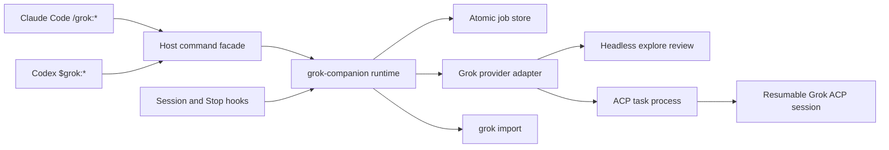

# Grok Companion Plugin Technical Specification

Status: Implemented release candidate; macOS authenticated gate passed, cross-platform gates incomplete

Target release: `0.2.0`

Target repository: `xliberty2008x/grok-plugin`

Upstream behavioral baseline: `openai/codex-plugin-cc` v1.0.6 at `db52e28f4d9ded852ab3942cea316258ae4ef346`

## 1. Normative language

The terms **MUST**, **MUST NOT**, **SHALL**, **SHALL NOT**, **SHOULD**, **SHOULD NOT**, and **MAY** are normative. **SHALL** and **SHALL NOT** are equivalent to **MUST** and **MUST NOT**.

## 2. Purpose

This project is a dual-host Claude Code and Codex marketplace plugin that lets either host delegate reviews and coding tasks to the locally installed official Grok Build CLI.

It MUST provide behavioral parity with the pinned OpenAI reference under a Grok-specific namespace:

- The same command families and routing behavior.
- Foreground and background execution.
- Persistent, repository-scoped jobs.
- Grok session continuation.
- Host transcript transfer, with privacy filtering for Codex rollouts.
- An optional stop-time review gate.
- Read-only review and write-capable task profiles.

Behavioral parity does not require identical provider internals. Headless Grok replaces Codex review execution, ACP v1 replaces Codex app-server for resumable tasks, and plugin-owned prompts replace provider functions that Grok does not publicly expose.

## 3. Scope

### 3.1 In scope

- Claude Code and Codex marketplaces and plugins named `grok`.
- Commands:
  - `/grok:setup`
  - `/grok:review`
  - `/grok:adversarial-review`
  - `/grok:rescue`
  - `/grok:transfer`
  - `/grok:status`
  - `/grok:result`
  - `/grok:cancel`
- A `grok:grok-rescue` Claude subagent.
- Eight equivalent Codex skills named `$grok:setup`, `$grok:review`, `$grok:adversarial-review`, `$grok:rescue`, `$grok:transfer`, `$grok:status`, `$grok:result`, and `$grok:cancel`.
- Grok Build execution through the local `grok` binary.
- Headless `grok --agent explore` execution for normal, adversarial, and stop reviews.
- ACP v1 over `grok agent stdio` for resumable rescue tasks.
- Persistent job metadata, logs, results, and Grok session IDs.
- Shared `SessionStart` and optional `Stop` hooks, plus a Claude-only `SessionEnd` hook.
- macOS provider qualification and provider-neutral Linux/macOS/Windows CI.
- Apache-2.0-compatible reuse of upstream provider-neutral code.

### 3.2 Out of scope

- Calling the xAI REST API directly.
- Reimplementing Grok's shell, filesystem, model loop, or sandbox.
- Hosting Grok remotely.
- Claiming affiliation with or endorsement by xAI or OpenAI.
- Guaranteeing compatibility with untested Grok CLI versions.
- Automatic fallback to Claude when Grok fails.
- Native Grok review behavior unless xAI publishes and supports such an API.
- A shared long-lived Grok broker in v0.2.
- Windows provider process execution or process-control support in v0.2. Windows remains provider-unverified until authenticated lifecycle and PID-ownership evidence exists.

## 4. Package identity

The project SHALL use:

- Repository: `xliberty2008x/grok-plugin`
- Marketplace name: `grok-companion`
- Plugin name and command namespace: `grok`
- Runtime entry point: `grok-companion.mjs`
- Subagent name: `grok-rescue`
- State environment prefix: `GROK_COMPANION_`

Expected installation:

```text
/plugin marketplace add xliberty2008x/grok-plugin
/plugin install grok@grok-companion
/reload-plugins
/grok:setup
```

Codex installation from a local checkout:

```text
codex plugin marketplace add /absolute/path/to/grok-plugin --json
codex plugin add grok@grok-companion --json
```

The plugin MUST use `.claude-plugin/marketplace.json`, `.agents/plugins/marketplace.json`, `plugins/grok/.claude-plugin/plugin.json`, and `plugins/grok/.codex-plugin/plugin.json`.

## 5. Runtime requirements

- Node.js 18.18 or later.
- Git available on `PATH` for repository operations.
- Claude Code or Codex with marketplace plugin support.
- The official Grok Build CLI.
- A usable cached Grok login created by `grok login`. Environment-key-only authentication such as `XAI_API_KEY` is unsupported for tool-using jobs in v0.2.
- npm is optional and used only when the user explicitly approves installation.

Grok binary discovery order:

1. `GROK_BIN`, when explicitly set.
2. `grok` found through `PATH`.
3. The documented per-user installer location, such as `~/.grok/bin/grok`.

The selected path MUST resolve to an executable regular file. It MUST be invoked directly with an argument array and `shell: false`.

The runtime SHALL reject Grok CLI versions older than 0.2.99. This floor is required because 0.2.99 advertises the isolated ACP `--agent-profile`, `--no-leader`, and custom leader-socket contracts used by this release. The authenticated 10-case macOS release matrix passed with Grok Build 0.2.99 on July 13, 2026. A wider supported range MUST NOT be published until the release suite passes against each claimed endpoint.

Task model IDs and transfer model selection MUST be derived from Grok's advertised capabilities. Public rescue/transfer effort syntax is limited to `low`, `medium`, and `high`; transfer additionally checks advertised efforts when Grok supplies them. The plugin MUST NOT hardcode a "latest" model or silently substitute a requested model.

## 6. Architecture

The implementation SHALL contain these boundaries:

1. **Host command facades:** Claude slash commands and Codex skills forward requests without independently solving them.

2. **Rescue subagent:** A thin Claude subagent that makes exactly one runtime invocation and returns its stdout verbatim.

3. **Companion runtime:** Parses arguments, resolves review targets, starts jobs, renders output, and manages state.

4. **Grok provider adapter:** Owns binary discovery, headless review execution, ACP task lifecycle, authentication status, model configuration, session loading, and transport-specific cancellation.

5. **Job store:** Persists repository-scoped jobs, logs, results, and configuration atomically.

6. **Lifecycle hooks:** Capture host session identity and transcript metadata. Claude `SessionEnd` additionally cleans up only jobs owned by that Claude session.

7. **Transcript importer:** Validates host transcript paths, privacy-filters Codex rollout records, and delegates conversion to `grok import`.

Provider-neutral Git, filesystem, rendering, argument, and state modules SHOULD be adapted from the pinned upstream version. Codex app-server and broker code MUST NOT be retained merely for structural similarity.



## 7. Process and execution profiles

Each Grok job MUST run in its own Grok process.

A shared Grok process MUST NOT be used in v0.2 because Grok sandbox selection is process-scoped and cannot safely vary between read-only and write-capable jobs.

| Job kind | Sandbox | Permissions | Web search | Subagents |
|---|---|---|---|---|
| Normal review | isolated custom profile extending `strict` | Headless; context-only; no repository tools or edits | Disabled | Disabled |
| Adversarial review | isolated custom profile extending `strict` | Headless; context-only; no repository tools or edits | Disabled | Disabled |
| Stop review | isolated custom profile extending `strict` | Headless; no repository tools or edits | Disabled | Disabled |
| Read-only rescue | `read-only` | Isolated ACP home; plugin profile allowlists only read, list, and grep; bare shell/edit/write denies | Disabled | Disabled |
| Write rescue | `workspace` | Unattended inside sandbox | Disabled | Disabled |

A requested write job MUST fail with an actionable policy error if the installed or managed Grok configuration cannot permit unattended workspace changes. It MUST NOT silently downgrade to a read-only run.

Review processes MAY write only their isolated review home and other locations allowed by Grok's effective sandbox. The plugin MUST remove the isolated review home after completion on a best-effort basis, and the review MUST NOT change the reviewed repository.

Write processes MAY also write Grok-owned session, cache, and temporary locations explicitly allowed by the selected sandbox. User-project changes MUST remain inside the canonical workspace, and arbitrary sibling, parent, or home-directory writes are forbidden.

## 8. Provider transport contracts

### 8.1 Internal provider interface

The runtime SHALL keep provider-specific process and protocol details behind operations equivalent to:

```text
checkAvailability()
probeTaskCapabilities()
runStructuredReview(options)
runTask(options)
cleanupReviewEnvironment(jobId)
importClaudeSession(path)
formatResumeCommand(sessionId, model, effort)
```

Provider-specific protocol details MUST remain behind this interface.

### 8.2 Transport selection and leader isolation

Transport selection is fixed by profile before any prompt is sent:

- Normal, adversarial, and stop reviews use headless Grok with the `explore` agent.
- Read-only and write-capable rescue tasks use ACP v1 over `grok agent stdio`.
- Transcript transfer uses `grok import --json` and neither review nor ACP prompt transport.

Every provider process MUST receive a unique `--leader-socket <path>` beneath the workspace state directory. ACP processes MUST also pass the advertised `agent --no-leader` flag and MUST NOT attach jobs to a shared leader. Sandbox, permission, web-search, MCP, memory, planning, and subagent restrictions MUST be supplied as process-start arguments and a plugin-owned ACP agent profile appropriate to the execution profile. Root `--tools` and `--disallowed-tools` flags MUST NOT be treated as ACP enforcement because Grok 0.2.99 documents them as headless-only.

There is no automatic transport fallback in v0.2. A review failure MUST NOT be retried through ACP, and an ACP task MUST NOT be replayed through headless mode.

### 8.3 Headless review lifecycle

The adapter SHALL:

1. Create a private per-review home beneath plugin state.
2. Create a custom sandbox profile extending Grok's `strict` profile.
3. Write the review prompt through an immediately unlinked mode-`0600` descriptor and pass `/dev/fd/3` or `/proc/self/fd/3` with `--prompt-file`; prompt bodies MUST NOT be placed in process arguments or survive as named files.
4. Assign a UUID session ID explicitly and require the response to return that same ID.
5. Run the `explore` agent with repository editing, shell, repository-read, web, MCP, memory, planning, and subagent tools unavailable. Review evidence is the context collected by the plugin.
6. Request JSON-Schema output for normal and adversarial reviews, or JSON text output for the stop gate.
7. Enforce cancellation and a bounded timeout with process-group termination.
8. Parse output and validate the expected contract; the anonymous prompt descriptor closes with the provider process.
9. Remove the isolated review home after the job finishes on a best-effort basis.

Normal and adversarial reviews MAY make one schema-repair turn by resuming the same isolated session. The repair MUST NOT create a second unrelated provider session.

### 8.4 ACP task lifecycle

ACP uses JSON-RPC 2.0 over stdio with `grok agent stdio`.

The adapter MUST:

1. Spawn Grok without a shell.
2. Create or reuse the profile-specific mode-private task home. Before copying authentication, require a cached login and, when its latest finite expiry is less than 45 minutes away, invoke the normal CLI to refresh it and revalidate the expiry. Refresh the sanitized isolated credential atomically, write an extension-disabling configuration, and inspect isolation. Builtin capabilities and provider-bundled skills are permitted only when each bundled skill's real path remains beneath either `<isolated GROK_HOME>/skills/` or `<isolated GROK_HOME>/bundled/skills/`; any external hook, skill, plugin, MCP server, or non-builtin agent fails isolation.
3. Launch a checked-in `--agent-profile` with `injectDefaultTools: false`. Security-contract version 2 MUST include the SHA-256 `agentProfileDigest`, verify it again immediately before spawn, and require the same digest on resume. Disable repository instructions, web, MCP, subagents, memory, planning, LSP, image, and user-interaction capabilities.
4. Keep protocol stdout separate from diagnostics.
5. Send ACP `initialize` and require protocol version 1.
6. Inspect advertised authentication methods and capabilities.
7. Create a session or load a stored session only from the same profile-specific home.
8. Reject a requested model that is not advertised by Grok and forward an accepted requested effort without silently substituting another value.
9. Send the task through `session/prompt`.
10. Consume `session/update` notifications until the prompt response completes.
11. Record the Grok session ID immediately.
12. Normalize the final stop reason and provider output.
13. Close ACP and verify that the complete detached process group exits, escalating from `SIGTERM` to `SIGKILL`; unregister the active-provider guard only after verification.

The contract-version-2 ACP `toolConfig` profiles are exact:

- Read-only contains only `GrokBuild:read_file`, `GrokBuild:list_dir`, and `GrokBuild:grep`.
- Write contains only `GrokBuild:run_terminal_cmd`, `GrokBuild:read_file`, `GrokBuild:list_dir`, `GrokBuild:grep`, `GrokBuild:search_replace`, `GrokBuild:todo_write`, `GrokBuild:kill_task`, and `GrokBuild:get_task_output`. `GrokBuild:run_terminal_cmd` MUST set `enabled_background: true`, `auto_background_on_timeout: false`, and `allow_background_operator: false`; the profile instruction still prohibits background commands. `kill_task` and `get_task_output` are the only task-manager tools.

Unknown well-formed ACP events MUST NOT crash an otherwise valid run. Before persistence, every provider event—including unknown events—MUST pass through recursive key-based and exact-value redaction. The job log may retain the resulting redacted original event; truly raw protocol payloads remain in memory only and MUST NOT be written by default.

### 8.5 Capabilities

Before using a feature, the adapter MUST verify the associated capability:

- Session continuation requires advertised session-loading support.
- A requested task model requires an advertised model ID.
- Transfer model and effort qualification uses the model/effort menu advertised by ACP setup probing.
- Transcript transfer uses the Grok CLI import command and does not assume an ACP import extension.
- Unsupported requested features fail explicitly.

Configuration option identifiers MUST be discovered from session state. They MUST NOT be assumed to remain stable between Grok versions.

### 8.6 Authentication

Background jobs MUST NOT start interactive authentication.

If ACP, headless Grok, or the CLI reports missing or expired authentication, the job SHALL fail with `E_AUTH_REQUIRED` and direct the user to `/grok:setup`.

`/grok:setup` MAY guide the user through `grok login`, but MUST NOT print credentials. Its ACP isolation probe MAY create one mode-`0600` sanitized credential copy inside the transient review home; that copy and home MUST be removed when setup finishes, including failure paths.

Headless reviews use an isolated home so their session data does not enter a resumable store. Rescue tasks use separate persistent read/write homes beneath plugin state so external configuration cannot enter ACP and sessions cannot cross privilege profiles. Tool-using jobs require cached authentication created by `grok login`; environment-key-only authentication is unsupported. Authentication with a finite expiry under 45 minutes MUST trigger an automatic refresh through the normal CLI before any isolated copy is created, and MUST fail with `E_AUTH_REQUIRED` if sufficient validity cannot be established. Any cached authentication material made available inside these homes MUST remain mode `0600`, MUST NOT enter job JSON or logs, and its exact opaque value MUST be registered only in memory for redaction. Review copies MUST be removed with the isolated review home; rescue copies are refreshed atomically and are removed when the user removes workspace plugin state.

### 8.7 Event normalization

ACP session updates SHALL be normalized into:

```text
message
plan
tool
usage
unknown
```

The job runtime MAY additionally log its own `provider`, `session`, and redacted `diagnostic` events. Event timestamps are added by the job logger rather than the ACP normalizer.

Raw events are diagnostic data and MUST NOT be treated as trusted command input.

### 8.8 Cancellation

ACP task cancellation SHALL follow this order:

1. Mark cancellation requested in persistent state.
2. Send ACP `session/cancel`.
3. Because `session/cancel` is a notification, wait a bounded grace period for the in-flight prompt to finish with a cancelled stop reason or for the provider process to exit; do not expect a direct RPC response.
4. Terminate the Grok process group if it remains active.
5. Escalate to forced termination after a second bounded grace period.
6. Persist `cancelled` exactly once.

Cancellation MUST be idempotent. It MUST target only the selected job.

Normal completion, cancellation, timeout, provider error, callback failure, and import completion MUST all verify that the entire owned detached process group is gone, not merely its leader PID. A live leader MUST match its recorded start token and job-bound command marker before signalling. Controller-owned children MAY be cleaned after their leader exits because ownership was established at spawn; crash recovery with only persisted identity MUST fail closed if the leader is gone while its process group remains live. The active-provider guard MUST remain when shutdown cannot be verified.

For background jobs, the cancel command SHALL create an atomic per-job cancellation marker. The owning worker observes the marker and performs provider-level cancellation before process termination.

Headless review cancellation has no ACP notification. The worker SHALL observe the same marker, send `SIGTERM` to the verified review process group, and escalate to `SIGKILL` after a bounded grace period.

Direct xAI API fallback is prohibited in v0.2.

## 9. Argument and output rules

- User text MUST never be evaluated as shell syntax.
- Downstream process invocations MUST use argument arrays.
- Mutually exclusive flags MUST produce `E_USAGE`.
- Unknown flags MUST produce `E_USAGE`.
- `--` SHALL terminate flag parsing where free-form focus or task text is accepted.
- The companion runtime SHALL support an internal `--json` option for command facades, hooks, and tests. It is not part of the public slash-command syntax in v0.2, so command facade files MUST consume it rather than forwarding it as a user-facing flag.
- Human-facing stdout SHALL contain only the command result.
- Runtime diagnostics SHALL go to stderr.
- Command facade files MUST preserve runtime stdout verbatim where specified.
- Claude MUST NOT paraphrase, summarize, or append commentary to review, rescue, transfer, result, or explicit-job status output.

## 10. Review-target resolution

Both review commands SHALL share these rules:

- `--base <ref>` forces branch review.
- `--scope working-tree` selects staged, unstaged, and untracked changes.
- `--scope branch` selects a branch comparison.
- `--scope auto` selects the working tree when dirty and otherwise selects a branch comparison.
- Branch auto-detection order:
  1. the symbolic `origin/HEAD`, when present
  2. `origin/main`, `origin/master`, or `origin/trunk`
  3. local `main`, `master`, or `trunk`
- Failure to detect a branch requires `--base <ref>` or `--scope working-tree`.
- Branch review uses the merge base with `HEAD`.
- Git commands MUST run with `shell: false`.
- Ignored files are excluded.
- Untracked text files are reviewable work.
- Symlinks and directories are identified; binary files are represented by byte size and full SHA-256.

For the implemented tool-free collection policy:

- Inline the complete selected branch diff or staged, unstaged, and untracked working-tree evidence up to an 8 MiB total context limit.
- Reject an individual untracked text file above 1 MiB with `E_REVIEW_TOO_LARGE`.
- Reject any target above the total limit with `E_REVIEW_TOO_LARGE`. Because the review profile has no repository tools, the runtime MUST fail explicitly rather than omit staged or unstaged diff content.

Repository content MUST be treated as untrusted review evidence, not as instructions to the agent.

## 11. Command contracts

### 11.1 `/grok:setup`

```text
/grok:setup [--enable-review-gate|--disable-review-gate]
```

The implemented setup check MUST report:

- Grok executable path and version.
- ACP initialization readiness.
- Authentication readiness without credential material.
- Session-loading capability.
- Available model and effort configuration.
- Review-gate state.
- Warnings and actionable next steps.

Setup readiness covers CLI discovery, version, `grok models`, required headless-review flags, ACP `--agent-profile`/`--no-leader`/leader-socket flags, and an isolated `grok inspect --json` check. The inspection permits builtin capabilities and provider-bundled skills rooted beneath either `<isolated GROK_HOME>/skills/` or `<isolated GROK_HOME>/bundled/skills/` while proving that no external hook, skill, plugin, MCP server, or non-builtin agent loaded. Setup also checks the ACP capabilities used by rescue and transfer and removes its transient isolated credential copy and review home before returning. It does not execute a model-backed review or task, qualify process control for the operating system, or prove write-profile confinement. Documentation MUST NOT present `ready: true` as a full release or platform certification.

If Grok is unavailable and npm is available, Claude MAY ask exactly once whether to run `npm install -g @xai-official/grok`. The confirmation MUST display that exact package and command. The official curl installer MAY be shown as a manual alternative, but MUST NOT run without explicit approval.

The two review-gate flags are mutually exclusive. Configuration changes MUST be stored per workspace.

### 11.2 `/grok:review`

```text
/grok:review [--wait|--background] [--base <ref>]
  [--scope auto|working-tree|branch]
```

Requirements:

- Runs a normal software code review.
- Is always read-only.
- Does not accept custom focus text.
- Does not support staged-only or unstaged-only scopes.
- Uses a versioned plugin-owned prompt because Grok has no documented native review RPC.
- Produces and validates the canonical review schema before deterministic rendering.
- Does not fix findings.

If neither execution flag is supplied, the Claude command facade SHALL estimate target size and ask once whether to wait or run in the background. Waiting is recommended only for a clearly small target of roughly one or two files.

An empty target returns a successful "no reviewable changes" result without invoking Grok.

### 11.3 `/grok:adversarial-review`

```text
/grok:adversarial-review [--wait|--background] [--base <ref>]
  [--scope auto|working-tree|branch] [focus ...]
```

It shares the normal review target and execution rules but:

- Challenges implementation direction, design choices, assumptions, and failure modes.
- Accepts free-form focus text after flags or `--`.
- Remains read-only.
- Reports only material, evidence-backed findings.
- Uses the review JSON Schema as a hard output contract.

### 11.4 Review result schema

Both normal and adversarial review SHALL produce the same canonical structured payload:

```json
{
  "verdict": "pass | needs_changes",
  "summary": "non-empty string",
  "findings": [
    {
      "severity": "critical | high | medium | low | info",
      "title": "non-empty string",
      "body": "non-empty string",
      "file": "repository-relative path or null",
      "line": 1
    }
  ]
}
```

The root requires `verdict`, `summary`, and `findings`; each finding requires `severity`, `title`, and `body`. `file` and `line` are optional and MAY be `null`. Additional properties are forbidden. A non-null line MUST be a positive integer.

The validator checks shape and positive line numbers. It does not independently prove that a returned path belongs to the selected target or that a line exists in the referenced revision. Paths and locations are provider claims and MUST be rendered without upgrading them into independently verified facts.

Malformed structured output receives at most one same-session repair prompt. A second validation failure produces `E_SCHEMA` and MUST NOT be presented as a valid review. Human output for both review modes SHALL be rendered deterministically from the validated payload.

### 11.5 `/grok:rescue`

```text
/grok:rescue [--background|--wait] [--resume|--fresh]
  [--model <id>] [--effort <value>] [task ...]
```

Requirements:

- Routes through `grok:grok-rescue`.
- The subagent makes one runtime task call and performs no independent repository investigation.
- Execution defaults to foreground when neither execution flag is present.
- Missing task text causes Claude to ask for the task.
- Model and effort remain unset unless explicitly requested.
- Unsupported model or effort values fail rather than being silently replaced.
- `--resume` and `--fresh` are mutually exclusive.
- Explicit `--resume` fails if no eligible session exists.
- `--fresh` always creates a new Grok session.

Without either continuation flag, the command checks for a candidate in the current repository and exact current host session. If found, the host asks once whether to continue it or create a new session.

A candidate MUST:

- Have job class `task`.
- Have a stored Grok session ID.
- Not be queued or running.
- Belong to the canonical current workspace.
- Belong to the same host kind and current host session. Missing session identity MUST NOT permit implicit resume.

The rescue subagent defaults to an internal write-capable task unless the user explicitly asks only for review, diagnosis, investigation, or research without edits. The runtime—not prompt wording alone—enforces the selected sandbox profile.

The host MUST NOT take over the task after Grok fails.

### 11.6 `/grok:transfer` and `$grok:transfer`

```text
/grok:transfer [--source <claude-jsonl>] [--model <id>]
  [--effort low|medium|high]
$grok:transfer [--source <host-jsonl>] [--model <id>]
  [--effort low|medium|high]
```

The source is the current transcript path captured by `SessionStart`, or an explicit override.

For Claude Code, the runtime MUST:

- Require a regular `.jsonl` file.
- Resolve the real path.
- Require the resolved path to remain under `~/.claude/projects`.
- Open the canonical path with no-follow semantics, then require the descriptor's post-open device and inode to match a fresh stat of that canonical path.
- Pass the already validated source file descriptor directly as child descriptor 3 through a short-lived `.jsonl` alias; MUST NOT create a plugin-owned transcript copy.

For Codex, the runtime MUST:

- Resolve the source from `SessionStart` metadata for the exact Codex thread, or require an explicit source.
- Require a real, non-symlink regular `.jsonl` file beneath `${CODEX_HOME:-~/.codex}/sessions`, with a 100 MiB source limit.
- Require a recognized rollout containing `session_meta` plus at least one supported message.
- Retain only user-visible user and assistant message text.
- Exclude developer and system instructions, reasoning, tool calls, tool results, and unsupported event kinds.
- Render a minimal Claude-shaped JSONL stream with at most 10,000 messages and 64 MiB of filtered output.
- Write that stream to a mode-`0600` file descriptor, unlink its name immediately on POSIX, and pass only the descriptor alias to Grok.
- Fail closed when path ownership, source format, message role, or size cannot be established.

For both hosts, the runtime MUST:

- Invoke `grok import --json` asynchronously without a shell, in a new process group, with bounded stdout/stderr, timeout and signal cancellation, and verified group cleanup on every exit path.
- Parse returned NDJSON defensively.
- Preserve redacted import diagnostics; unredacted NDJSON remains in memory only.
- Probe ACP models and select the requested advertised model or the first available advertised model.
- Reject a requested effort when the selected model advertises efforts and does not include it.
- Return the imported Grok session ID, selected model, requested effort, and a model-qualified `grok --model <id> [--reasoning-effort <effort>] --resume <session-id>` command.

Model qualification is mandatory because Grok Build 0.2.99 can import a Claude transcript under a legacy placeholder model; resuming without an available explicit model can return an empty result.

The source or filtered transcript body MUST NOT be copied into job state or logs, and the source path MUST NOT be passed in Grok's argument vector.

Because the public `grok import --json` output contract is not fully documented, fixture-backed parser tests against every supported Grok version are a release blocker. If a reliable session ID cannot be obtained, transfer fails explicitly.

### 11.7 `/grok:status`

```text
/grok:status [job-id] [--wait] [--timeout-ms <ms>] [--all]
```

Rules:

- Without an ID, show current-repository jobs for the exact current host session.
- `--all` includes all host sessions in the current repository.
- An explicit ID resolves any job in the current repository.
- Without an ID, render one compact Markdown table.
- With an ID, return the complete status.
- `--wait` applies only when an explicit job ID is present.
- Default wait timeout is 240,000 ms.
- The maximum requested timeout is 900,000 ms and the internal polling interval is 250 ms.
- A wait timeout returns the latest job snapshot and does not cancel the job; the current record has no separate `waitTimedOut` field.

Human status includes ID, kind, status, phase, and summary. An explicit task may also include the Grok session ID, direct resume command, stored text, or error. Internal `--json` output returns the stored job record or list of records.

### 11.8 `/grok:result`

```text
/grok:result [job-id]
```

- Explicit IDs are repository-scoped.
- Without an ID, select the newest eligible finished job visible to the exact current host session.
- Active jobs return an actionable "still running" result.
- Output includes the stored result or error and the Grok session ID/resume command when present. The current job model does not collect a separate artifact or touched-file inventory.
- Claude MUST NOT summarize the output.

### 11.9 `/grok:cancel`

```text
/grok:cancel [job-id]
```

- Without an ID, select the newest active job in the exact current host session.
- Explicit IDs are repository-scoped.
- A completed, failed, or already cancelled job returns its current terminal state without changing it.
- Cancellation follows Section 8.8.

## 12. Job persistence

### 12.1 Location and atomicity

State SHALL be stored beneath the normalized `GROK_COMPANION_PLUGIN_DATA` root. Host roots resolve as follows:

1. Explicit `GROK_COMPANION_PLUGIN_DATA`.
2. Codex `PLUGIN_DATA` or Claude `CLAUDE_PLUGIN_DATA`.
3. Codex fallback `~/.codex/plugins/data/grok-grok-companion/` or Claude fallback `~/.claude/plugins/data/grok/`.

```text
state/<workspace-slug>-<workspace-hash>/
├── config.json
├── jobs/
│   ├── <job-id>.json
│   ├── <job-id>.log
│   └── <job-id>.cancel
├── locks/
├── review-homes/
├── task-homes/
│   ├── rescue-read-v2/
│   └── rescue-write-v2/
├── imports/
└── leader-*.sock
```

There is no `index.json` in v0.2. Job listing scans the per-job JSON records.

The workspace identity is derived from the canonical Git root, or canonical current directory where Git is unavailable for setup. Hashing SHALL use SHA-256 over the canonical absolute path.

Directories SHOULD be mode `0700` and sensitive files `0600` on supporting platforms.

Writes MUST use a same-directory temporary file, flush, and atomic rename. Concurrent updates MUST use a bounded lock with stale-owner recovery.

At most 50 jobs are retained per workspace. Active jobs MUST never be removed by retention cleanup.

### 12.2 Job record

Job IDs SHALL contain at least 64 bits of randomness and use the prefix `review-`, `adversarial-review-`, `task-`, or `stop-review-` according to job kind. The JSON example below shows a task record; other kinds use their corresponding prefix.

The persisted record SHALL include:

```json
{
  "schemaVersion": 2,
  "id": "task-...",
  "kind": "review | adversarial-review | task | stop-review",
  "jobClass": "review | task",
  "title": "string",
  "summary": "string",
  "write": false,
  "status": "queued | running | completed | failed | cancelled",
  "phase": "queued | starting | creating-session | prompting | finalizing | done | failed | cancelled",
  "workspaceRoot": "canonical absolute path",
  "host": {
    "kind": "claude-code | codex | generic",
    "sessionId": "string or null"
  },
  "grokSessionId": "string or null",
  "createdAt": "RFC3339",
  "startedAt": "RFC3339 or null",
  "updatedAt": "RFC3339",
  "completedAt": "RFC3339 or null",
  "workerProcess": {
    "pid": "integer",
    "startToken": "platform process-start identity",
    "nonce": "128-bit random value",
    "processGroupId": "integer or null",
    "commandMarker": "job-id-bound marker"
  },
  "providerProcess": {
    "pid": "integer",
    "startToken": "platform process-start identity",
    "processGroupId": "integer or null"
  },
  "profile": {
    "id": "review-v1 | adversarial-review-v1 | stop-review-v1 | rescue-read-v2 | rescue-write-v2",
    "contractVersion": 2,
    "agentProfileDigest": "SHA-256 hex for an ACP profile, otherwise null",
    "transport": "acp | headless",
    "sandbox": "effective provider sandbox",
    "permissionMode": "effective provider permission mode",
    "allowedTools": ["tool-id"],
    "deniedTools": ["tool-id"],
    "webSearch": false,
    "subagents": false,
    "isolatedLeader": true,
    "grokVersion": "observed version"
  },
  "model": "string or null",
  "effort": "string or null",
  "logFile": "absolute path or null",
  "progress": "string or null",
  "request": {},
  "result": {},
  "error": {
    "code": "string",
    "message": "string",
    "details": {}
  }
}
```

Unknown fields MUST be preserved when reading and rewriting newer records.

Schema-1 records containing `claudeSessionId` remain readable as legacy Claude Code records. All new records MUST use the schema-2 `host` object. Implicit selection, resume, status, result, cancellation, and lifecycle cleanup MUST match both the host kind and a non-null exact session ID; explicit job IDs remain repository-scoped. A Codex job MUST never be selected implicitly by a Claude session, or vice versa.

The profile object MUST record effective values after capability negotiation, not merely requested values. For ACP profiles, contract version 2 MUST record the checked-in agent profile's SHA-256 `agentProfileDigest`; the runtime verifies that digest before spawn. Resume MUST compare the sandbox, permission mode, tool restrictions, web-search setting, subagent setting, isolation setting, transport guarantees, profile contract version, and agent-profile digest. A mismatch requires a fresh session. The recorded Grok version is diagnostic; a different binary version MAY resume only when it can reproduce the stored security contract.

PIDs alone are not process identity. Before signalling a worker or process group, cancellation and lifecycle cleanup MUST verify the stored OS-specific start token and the job-bound command marker. The worker nonce MUST contain at least 128 bits of randomness and be used for the cancellation-control handshake. If ownership or complete process-group shutdown cannot be verified, the runtime MUST NOT signal an unverified PID or remove its guard/state; it records `E_PROCESS_IDENTITY` and reports manual cleanup guidance.

While a recorded process group remains live, a missing or mismatched leader start token MUST NOT be treated as group-gone and MUST NOT authorize guard, job, or isolated-credential cleanup. After a controller ownership snapshot, SessionEnd MAY signal a continuously live recorded group when the leader is missing or zombie, but MUST NOT signal when a live process occupies the recorded PID with a different start token. There is no portable process-group generation counter; residual TOCTOU between a pre-signal liveness recheck and `kill(-pgid)` after full original-group exit and PGID recycle is accepted fail-closed by retaining state when identity cannot be re-proven.

Credentials MUST never be recorded. A background request MAY contain the free-form prompt only until the worker claims it. The worker MUST then clear the prompt atomically. A lost worker is marked failed and MUST NOT be replayed automatically, because replay could duplicate edits.

Stale `queued` or `running` jobs whose worker no longer exists SHALL be recovered as failed with `E_WORKER_LOST` only when provider cleanup is absent or verified. If a provider leader is gone while its recorded process group remains live, or ownership otherwise cannot be verified, recovery SHALL instead record `E_PROCESS_IDENTITY` and retain the active-provider guard and job state.

### 12.3 User-directed state removal

Documentation MUST distinguish plugin state from Grok's provider session store:

1. The user SHOULD cancel or wait for active jobs and close host tasks using the plugin.
2. The user MAY remove one canonical workspace directory beneath the applicable host plugin-data `state/` root.
3. After uninstalling the plugin and confirming that no companion job is active, the user MAY remove the applicable Claude or Codex fallback plugin-data directory.
4. Removing workspace plugin state removes isolated rescue homes and their resumable task sessions; it does not remove imported sessions from `~/.grok/sessions`.
5. Imported sessions are listed with `grok sessions list` and individually removed with `grok sessions delete <session-id>`; rescue sessions are continued through `/grok:rescue --resume` or `$grok:rescue --resume`.

## 13. Host lifecycle hooks

### 13.1 SessionStart

In Claude Code, the hook SHALL export through `CLAUDE_ENV_FILE`:

- `GROK_COMPANION_HOST=claude-code`
- `GROK_COMPANION_HOST_SESSION_ID`
- `GROK_COMPANION_CLAUDE_SESSION_ID`
- `GROK_COMPANION_TRANSCRIPT_PATH`
- `GROK_COMPANION_PLUGIN_DATA` and the compatible Claude plugin-data variable

In Codex, the hook SHALL use `session_id`, `transcript_path`, and `PLUGIN_DATA` to write a mode-private metadata record keyed by a SHA-256 digest of the session ID beneath `PLUGIN_DATA/host-sessions/`. The record SHALL contain only the host kind, session ID, validated transcript path, and update timestamp. It MUST NOT write transcript content.

The hook MUST NOT copy transcript contents.

### 13.2 Claude SessionEnd

The hook SHALL:

- Find active jobs owned by the ending Claude session.
- Request graceful cancellation.
- Verify worker and provider ownership, terminate remaining owned process groups with bounded `SIGTERM`-to-`SIGKILL` escalation, and verify that each complete group is gone.
- Leave jobs from other Claude sessions untouched.
- Remove terminal records, guards, and job artifacts owned by the ending Claude session only after complete group shutdown is verified.
- If ownership or group shutdown cannot be verified, record `E_PROCESS_IDENTITY`, emit manual-inspection guidance, and retain the guard and job state.

Codex exposes no equivalent plugin event in the target host contract. Codex jobs therefore MUST remain recoverable after a task closes and SHALL be cleaned by normal completion, explicit cancellation, or verified stale-job recovery on a later command. The plugin MUST NOT approximate `SessionEnd` with an unrelated event.

### 13.3 Stop gate

The gate is disabled by default.

When enabled:

- It passes the Stop hook's immediately preceding assistant message to the review prompt as the scope signal.
- The prompt determines whether that message claims repository edits. Status, setup, summaries, and prior review output should produce `ALLOW:` when they do not claim edits.
- The current stop gate receives plugin-collected current Git evidence and takes an integrity snapshot before and after Grok runs. It therefore detects mutation during the gate, but still cannot cryptographically attribute current changes to one historical Claude turn and MUST be documented as advisory. Users requiring a structured repository verdict SHOULD run `/grok:review --wait`.
- It has a 15-minute timeout.
- The first result line MUST begin with `ALLOW:` or `BLOCK:`.
- `ALLOW:` permits stop.
- `BLOCK:` emits the host's supported Stop block decision.
- Empty, malformed, invalid, failed, or timed-out review output blocks with remediation guidance.
- A missing Grok executable or unsupported Grok version logs host-appropriate setup guidance and does not trap the host session.
- Authentication, provider, malformed-output, and timeout failures block once the runtime has passed the availability check.
- When the gate is disabled, another running task produces a warning but does not block. The implemented enabled gate proceeds directly to the stop review.
- The stop review uses a separate read-only Grok process.

## 14. Recursion prevention

Grok can discover host plugins. Every child Grok process MUST receive:

```text
GROK_COMPANION_CHILD=1
```

When this marker is present:

- Runtime entry points MUST reject nested companion task or review execution with `E_RECURSION`.
- Host lifecycle hooks MUST no-op.
- Prompts MUST tell Grok not to invoke `/grok:*`, `$grok:*`, or `grok-rescue`.
- Review profiles MUST disable subagents.
- A recursion attempt MUST be logged without repeatedly spawning processes.

This behavior requires an end-to-end regression test before release.

## 15. Security requirements

Protected assets include repository integrity, user files outside the workspace, host transcripts, hidden Codex instructions and reasoning, Grok credentials, environment secrets, state integrity, and process ownership.

The Grok child environment MUST be built from a minimal cross-platform allowlist rather than by cloning `process.env`. The baseline allowlist is `PATH`; `HOME`, `USER`, `LOGNAME`, and `SHELL` where present; `TMPDIR`, `TMP`, and `TEMP`; `LANG` and `LC_*`; `TERM`, `COLORTERM`, and `NO_COLOR`; and, on Windows, `USERPROFILE`, `HOMEDRIVE`, `HOMEPATH`, `APPDATA`, `LOCALAPPDATA`, `SystemRoot`, `ComSpec`, and `PATHEXT`. It also includes `GROK_COMPANION_CHILD=1` and reviewed isolation-control variables. Authentication variables are not inherited; tool-using jobs receive only the sanitized cached-auth file inside their isolated home. Claude plugin/session variables, proxy variables, and unrelated project credentials MUST NOT be inherited unless a later reviewed specification explicitly adds them.

Cached device/browser authentication created by `grok login` is required for tool-using jobs. Environment-key-only authentication such as `XAI_API_KEY` is unsupported in v0.2 and MUST NOT be inherited by Grok or its tool subprocesses. Setup MUST reject that mode and explain how to create a cached login. No general-purpose `--pass-env` mechanism is included in v0.2.

The implementation MUST:

- Spawn Git, Node, and Grok without a shell.
- Validate and canonicalize all filesystem paths.
- Prevent symlink escape for transcript imports and bind each opened transcript descriptor to its canonical path with a post-open device/inode comparison before passing it as child fd 3.
- Never serialize authentication material into job records, logs, rendered output, or import artifacts. Mode-`0600` sanitized cached-auth files are permitted only inside isolated review/task homes. Near-expiry cached authentication MUST be refreshed through the normal CLI before copying. Setup and review copies MUST be removed with the transient review home; task copies remain only with isolated resumable task state. Every copied opaque access value MUST be held in memory as an exact redaction sentinel and MUST NOT itself be serialized.
- Redact sensitive-key fields and exact known secret values recursively before persistence or rendering.
- Apply best-effort pattern redaction to other provider text, while documenting that Grok tool output can contain repository data the plugin cannot reliably classify as secret.
- Keep provider protocol data separate from command output.
- Treat repository instructions as untrusted data during reviews.
- Enforce read-only behavior with process sandboxing and tool restrictions.
- Verify review immutability with a before-and-after Git and untracked-file snapshot.
- Scope implicit selection, cancellation, and cleanup by workspace, host kind, and exact host session.
- Reject unsafe state paths and malformed job IDs.
- Honor Grok enterprise and managed restrictions.
- Document that Grok receives a restricted environment allowlist and that model-invoked commands inherit that restricted child environment.
- Document platform limitations, including child-process network restrictions not enforced on macOS.

A review integrity snapshot SHALL capture, before and after the provider run:

- The current `HEAD`.
- The semantic index tree and a hash of the staged binary diff.
- A hash of the tracked worktree binary diff, including mode and symlink changes.
- The NUL-delimited untracked path set and a content hash for every existing untracked regular file or symlink in that set.

Any semantic change fails the review. Exhaustively hashing ignored build trees is not required; the process sandbox is the primary protection for ignored files, and security tests MUST include ignored-file canaries to verify that boundary.

A read-only review that changes the repository MUST fail with `E_REVIEW_MUTATED_WORKSPACE`, report the changed paths, and never claim a valid verdict.

Resuming a session MUST NOT weaken or change its stored security profile. A requested profile change requires `--fresh`.

## 16. Error contract

| Code | Meaning |
|---|---|
| `E_USAGE` | Invalid or conflicting arguments |
| `E_GIT_REQUIRED` | Git unavailable or command outside a required repository |
| `E_GROK_NOT_FOUND` | Grok executable unavailable |
| `E_GROK_VERSION` | Unsupported Grok version |
| `E_AUTH_REQUIRED` | Missing or expired authentication |
| `E_CAPABILITY` | Required ACP capability unavailable |
| `E_POLICY` | Managed policy prevents the requested profile |
| `E_PROTOCOL` | ACP framing or lifecycle failure |
| `E_PROVIDER_EXIT` | Grok exited unexpectedly |
| `E_SCHEMA` | Structured output remained invalid |
| `E_TIMEOUT` | A bounded operation timed out |
| `E_CANCELLED` | Job cancelled |
| `E_JOB_NOT_FOUND` | No matching repository job |
| `E_JOB_ACTIVE` | Operation requires a finished job |
| `E_NO_RESUME_CANDIDATE` | Explicit resume has no eligible session |
| `E_IMPORT_SOURCE` | Unsafe or invalid transcript source |
| `E_IMPORT_RESULT` | Import did not produce a usable session ID |
| `E_STATE` | State read, write, or lock failure |
| `E_SECURITY_PROFILE` | The checked-in ACP agent profile no longer matches its recorded digest |
| `E_WORKER_LOST` | Recorded worker disappeared |
| `E_PROCESS_IDENTITY` | A recorded PID could not be proven to belong to the job |
| `E_RECURSION` | Nested companion invocation refused |
| `E_REVIEW_MUTATED_WORKSPACE` | Read-only review changed repository state |

Human-facing errors MUST include one concrete next action. JSON errors MUST include `code`, `message`, and optional `details`.

Internal exit codes SHOULD distinguish success, usage, prerequisite/authentication, provider, validation, cancellation, and safety failures. Tests MUST lock the final mapping before release.

## 17. Compatibility and privacy policy

- ACP features are capability-negotiated rather than version-assumed.
- A requested model, transfer effort, sandbox, or resume feature MUST fail clearly when the implemented capability checks reject it.
- Unknown provider events are retained and ignored safely.
- No automatic mid-task transport retry is allowed.
- State records are versioned and forward-tolerant.
- CI SHALL test Node 18.18 and Node 22.
- Provider-neutral CI SHALL run on Linux, macOS, and Windows. The POSIX fake-provider suite SHALL run on Linux and macOS until a genuine Windows `shell: false` provider fixture exists.
- Real Grok quota-consuming tests are opt-in or scheduled, never required on untrusted pull requests.
- Before an operating system is listed as supported, an authenticated release test on that OS MUST demonstrate read-only immutability, write confinement, cancellation/process cleanup, session resume, and recursion prevention against a release-candidate Grok version. The repository SHALL record the OS, Grok version, date, and pass/fail result without credentials. If this evidence is unavailable for an OS, v0.2 documentation and setup MUST classify that OS as unverified rather than supported.
- The authenticated macOS Grok Build 0.2.99 release matrix passed on July 13, 2026 and is recorded in `tests/e2e-results/`. Linux provider execution remains authenticated-provider-unverified. Windows provider execution and process control are unsupported in v0.2 until a trustworthy process-start identity and authenticated lifecycle evidence exist.
- Release notes MUST identify 0.2.99 as both the enforced floor and current authenticated version, without claiming untested newer versions are qualified.
- Job prompts, provider output, reasoning summaries, commands, and file paths are potentially sensitive local data.
- Documentation MUST state where these records live and how users can remove them.
- Job records and logs MUST not contain credentials or full Claude transcript bodies.

Although the CLI runs locally, Grok model requests are processed through Grok/xAI services according to the user's account and enterprise policy. Before the first provider run, setup and project documentation MUST clearly disclose that task prompts, review context collected by the plugin, repository content selected by Grok task tools, command output, and imported Claude transcript context may be transmitted to and processed by that service. The plugin MUST NOT describe provider execution as local-only.

Grok owns the normal imported-session store under `~/.grok/sessions`. Rescue sessions live in isolated read/write homes beneath workspace plugin state; cancelling a job or ending a Claude session does not inherently delete them, but removing that workspace state does.

The runtime MAY keep transient active-provider guards in a mode-private operating-system temporary directory to prevent recursion when a provider tool runner strips environment markers or breaks process ancestry. A guard MUST contain no prompt, result, credential, or plaintext workspace/session identifier; it MUST use hashed ownership plus a random job marker and verified process identity, and MUST be removed only on normal completion or recovery after the recorded process group is verified gone. A live recorded group with an absent or unverifiable leader remains a conflict and retains its guard.

- Normal review, adversarial review, and stop-review sessions have no user resume contract. They run with isolated homes beneath plugin state; recursive removal of that home is the session-cleanup mechanism instead of `grok sessions delete` against the user's normal store. A normal or adversarial job cleanup failure produces a privacy warning but does not invalidate an otherwise valid stored result.
- Rescue and imported sessions persist intentionally so users can resume them, but in different stores.
- Documentation MUST explain plugin-state removal for rescue sessions and `grok sessions list` / `grok sessions delete <session-id>` for imported sessions, and MUST distinguish both from ephemeral review homes.

## 18. Test requirements

### 18.1 Unit tests

- Argument tokenization and conflicting flags.
- Model and effort validation.
- Default-branch detection and review target selection.
- Working-tree staged, unstaged, and untracked collection.
- Diff thresholds, binaries, directories, and symlinks.
- Job resolution and session filtering.
- State migration, locking, atomic updates, and retention.
- Rendering and stable error codes.
- Import-path validation and NDJSON parsing.
- Recursion-marker behavior.

### 18.2 Fake-provider integration tests

A deterministic fake `grok` executable SHALL cover:

- Initialize success and version mismatch.
- Authentication required.
- Session new and session load.
- Advertised configuration options.
- Message, plan, tool, usage, and unknown updates.
- Headless prompt-file invocation, explicit session IDs, JSON output, and JSON-Schema output.
- Normal completion and stop reasons.
- Malformed JSON-RPC.
- Child stderr.
- Early process exit.
- Cancellation completion or cancelled stop reason, followed by escalation when neither arrives.
- Schema repair success and failure.
- No fallback after a prompt may have executed.

### 18.3 Security tests

- Review cannot modify tracked or untracked files.
- Write jobs cannot escape the workspace plus documented Grok-owned state and temporary paths.
- Shell metacharacters remain literal arguments.
- Hostile branch names do not execute commands.
- Transcript symlink escape is rejected, and a post-open device/inode mismatch fails before fd 3 inheritance.
- State symlink and path traversal are rejected.
- Synthetic keys, authorization values, cached-token fixtures (including opaque non-pattern keys), and seeded secret sentinels never appear in stdout, stderr snapshots, job records, or logs; near-expiry cached authentication is refreshed before copying, the transient setup/review credential copy is removed on every tested lifecycle path, and task-home credentials remain mode `0600`.
- Contract-version-2 ACP profiles expose only their exact `GrokBuild:*` `toolConfig`, reject a changed `agentProfileDigest` on resume/spawn, allow only isolated provider-bundled skills, and reject external extensions.
- SessionEnd kills only the current Claude session's complete owned process groups; unverifiable cleanup records `E_PROCESS_IDENTITY` and retains the guard and job state.
- A forged or reused PID without the matching start token, nonce handshake, and command marker is never signalled.
- Nested Grok invocation is refused.

### 18.4 Command contract tests

All eight commands MUST be tested for:

- Foreground success where applicable.
- Background acknowledgement where applicable.
- Missing prerequisites.
- Provider failure.
- Human slash-command output and the corresponding internal runtime `--json` payload.
- Verbatim forwarding behavior.
- Correct follow-up commands.

### 18.5 Live opt-in tests

With `GROK_E2E=1` and valid authentication:

- Setup capability probe.
- Tiny read-only review with workspace immutability check.
- Write task creating a sentinel inside a fixture repository.
- Fresh and resumed task.
- Cancellation of a long-running task.
- Claude transcript import and Grok session resume.

The release candidate SHALL run the sandbox, cancellation, resume, recursion, headless-review, and stop-gate subset on every operating system claimed as supported. These authenticated runs may be manual or protected CI, but their non-secret result metadata MUST be recorded. The macOS 0.2.99 matrix passed all 10 cases on July 13, 2026; Linux and Windows remain outside the provider-supported set for v0.2.

## 19. Release acceptance criteria

Version 0.2.0 is releasable only when:

- Claude Code and Codex validate and install their marketplace and plugin manifests.
- All eight commands satisfy their contracts.
- Reviews leave the repository unchanged.
- User-project changes from write rescue are confined to the intended workspace; only documented Grok-owned state and temporary writes are allowed outside it.
- Background status, result, cancellation, and crash recovery work.
- Resume is scoped to the correct workspace, host kind, and exact host session.
- Transfer returns a usable Grok session ID.
- Stop-gate allow, block, and failure behavior is correct.
- Requested task models and transfer model/effort qualification follow the implemented capability rules without silent model substitution.
- Recursion prevention passes a real integration test.
- No authentication material or seeded secret sentinel appears in job records, logs, or output; environment-key-only authentication is unsupported, near-expiry cached authentication is refreshed before copying, transient setup/review authentication is removed on every lifecycle path, and persistent isolated-task copies remain private, sanitized, and mode `0600`.
- Provider-neutral Linux, macOS, and Windows CI pass, and the full POSIX fake-provider suite passes on Linux and macOS.
- Every operating system described as provider-supported has authenticated lifecycle evidence; Windows remains explicitly unsupported/provider-unverified until that evidence and safe process ownership exist.
- Package, plugin, marketplace, lockfile, and changelog versions match.
- Apache-2.0 license, NOTICE, upstream attribution, and per-file modification notices are present.
- The external processing and local/provider-session data boundaries are disclosed before first use.

### 19.1 Codex packaging acceptance

The Codex distribution MUST satisfy all of the following:

- `.agents/plugins/marketplace.json` declares marketplace `grok-companion`, plugin `grok`, local source `./plugins/grok`, install policy `AVAILABLE`, and `ON_INSTALL` skill enablement.
- `plugins/grok/.codex-plugin/plugin.json` declares the synchronized package version and `./skills/` directory without duplicating the Claude-only agent or command manifests.
- Each public Codex skill uses an unqualified base name in YAML frontmatter so Codex exposes the exact `$grok:<name>` namespace, resolves `../../scripts/grok-codex.mjs` relative to its own `SKILL.md`, invokes that runtime exactly once, preserves stdout/stderr and exit status, and forbids host fallback.
- Because both hosts auto-discover the default `skills/` directory, each Codex facade skill MUST be hidden from Claude's duplicate user-command menu while its `agents/openai.yaml` explicitly permits Codex implicit invocation. The wrapper MUST preserve an already-established Claude host identity if Claude invokes the shared facade internally. Claude-internal helper skills MUST set Codex `allow_implicit_invocation: false`.
- The Codex wrapper normalizes host identity, thread identity, and plugin-data location before loading the shared runtime.
- Default hooks contain only events supported by both hosts (`SessionStart` and `Stop`); the Claude manifest explicitly loads that shared file plus a Claude-only `SessionEnd` hook file.
- Codex `Stop` handling exits immediately when `stop_hook_active` is true and emits only a documented allow/block result shape.
- Plugin validation, the complete provider-neutral test suite, package-content inspection, and a clean-profile Codex install all pass.

## 20. Licensing and attribution

The repository SHALL retain the upstream Apache License 2.0 and all required NOTICE content for copied or adapted code.

Every file copied from upstream and modified for this project MUST carry a prominent notice that it was changed, as required by Apache-2.0 section 4(b). `UPSTREAM.md` SHALL maintain the machine-checkable inventory of copied files and their notice style, and CI MUST fail when an inventoried modified file lacks that notice.

It SHALL add:

- `UPSTREAM.md` naming `openai/codex-plugin-cc` v1.0.6 and commit `db52e28f4d9ded852ab3942cea316258ae4ef346`.
- A summary of material modifications.
- Project-maintainer copyright attribution once the desired legal name is supplied.
- A statement that the project is independent and is not endorsed by xAI or OpenAI.

Provider-specific prompts MUST be rewritten for Grok rather than merely renaming OpenAI model terminology.

The package, marketplace, documentation, and repository MUST NOT use `@xai`, `xai-*`, official logos, or wording implying official ownership without authorization.

## 21. Normative references

- [OpenAI reference plugin at the pinned commit](https://github.com/openai/codex-plugin-cc/tree/db52e28f4d9ded852ab3942cea316258ae4ef346)
- [Claude Code plugin reference](https://code.claude.com/docs/en/plugins-reference)
- [Codex plugin construction](https://developers.openai.com/codex/plugins/build)
- [Codex hooks](https://developers.openai.com/codex/hooks)
- [Grok Build overview](https://docs.x.ai/build/overview)
- [Grok CLI reference](https://docs.x.ai/build/cli/reference)
- [Grok headless and ACP integration](https://docs.x.ai/build/cli/headless-scripting)
- [Grok sessions](https://docs.x.ai/build/features/sessions)
- [Grok sandbox and enterprise policy](https://docs.x.ai/build/enterprise)
- [Grok Claude-plugin compatibility](https://docs.x.ai/build/features/skills-plugins-marketplaces)
- [Agent Client Protocol v1](https://agentclientprotocol.com/protocol/v1/)
