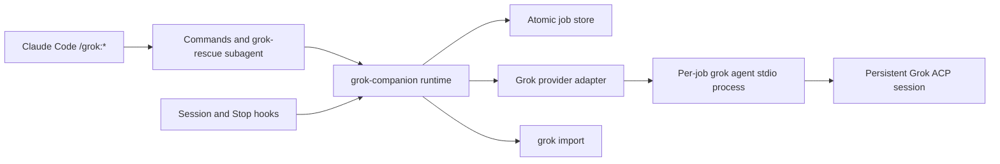

# Grok Companion Plugin Technical Specification

Status: Planning baseline (implementation not started)

Target release: `0.1.0`

Target repository: `xliberty2008x/grok-plugin`

Upstream behavioral baseline: `openai/codex-plugin-cc` v1.0.6 at `db52e28f4d9ded852ab3942cea316258ae4ef346`

## 1. Normative language

The terms **MUST**, **MUST NOT**, **SHALL**, **SHALL NOT**, **SHOULD**, **SHOULD NOT**, and **MAY** are normative. **SHALL** and **SHALL NOT** are equivalent to **MUST** and **MUST NOT**.

## 2. Purpose

This project is a Claude Code marketplace plugin that lets Claude delegate reviews and coding tasks to the locally installed official Grok Build CLI.

It MUST provide behavioral parity with the pinned OpenAI reference under a Grok-specific namespace:

- The same command families and routing behavior.
- Foreground and background execution.
- Persistent, repository-scoped jobs.
- Grok session continuation.
- Claude transcript transfer.
- An optional stop-time review gate.
- Read-only review and write-capable task profiles.

Behavioral parity does not require identical provider internals. Grok ACP replaces Codex app-server, and plugin-owned prompts replace provider functions that Grok does not publicly expose.

## 3. Scope

### 3.1 In scope

- A Claude Code marketplace and plugin named `grok`.
- Commands:
  - `/grok:setup`
  - `/grok:review`
  - `/grok:adversarial-review`
  - `/grok:rescue`
  - `/grok:transfer`
  - `/grok:status`
  - `/grok:result`
  - `/grok:cancel`
- A `grok:grok-rescue` Claude subagent.
- Grok Build execution through the local `grok` binary.
- ACP v1 over `grok agent stdio` as the primary transport.
- Persistent job metadata, logs, results, and Grok session IDs.
- Claude `SessionStart`, `SessionEnd`, and optional `Stop` hooks.
- macOS, Linux, and Windows support.
- Apache-2.0-compatible reuse of upstream provider-neutral code.

### 3.2 Out of scope

- Calling the xAI REST API directly.
- Reimplementing Grok's shell, filesystem, model loop, or sandbox.
- Hosting Grok remotely.
- A Codex `.codex-plugin` package.
- Claiming affiliation with or endorsement by xAI or OpenAI.
- Guaranteeing compatibility with untested Grok CLI versions.
- Automatic fallback to Claude when Grok fails.
- Native Grok review behavior unless xAI publishes and supports such an API.
- A shared long-lived Grok broker in v0.1.

## 4. Package identity

The project SHALL use:

- Repository: `xliberty2008x/grok-plugin`
- Marketplace name: `grok-companion`
- Plugin name and command namespace: `grok`
- Runtime entry point: `grok-companion.mjs`
- Subagent name: `grok-rescue`
- State environment prefix: `GROK_COMPANION_`

Expected installation:

```text
/plugin marketplace add xliberty2008x/grok-plugin
/plugin install grok@grok-companion
/reload-plugins
/grok:setup
```

The plugin MUST use `.claude-plugin/marketplace.json` and `plugins/grok/.claude-plugin/plugin.json`.

## 5. Runtime requirements

- Node.js 18.18 or later.
- Git available on `PATH` for repository operations.
- Claude Code with marketplace plugin support.
- The official Grok Build CLI.
- A valid Grok authentication method accepted by the local CLI.
- npm is optional and used only when the user explicitly approves installation.

Grok binary discovery order:

1. `GROK_BIN`, when explicitly set.
2. `grok` found through `PATH`.
3. The documented per-user installer location, such as `~/.grok/bin/grok`.

The selected path MUST resolve to an executable regular file. It MUST be invoked directly with an argument array and `shell: false`.

The provisional compatibility test matrix is Grok CLI 0.2.93 and 0.2.99. This is a test target, not a support claim. The minimum supported version MUST be fixed only after ACP, sandbox, cancellation, and import contract tests pass.

Models and reasoning-effort values MUST be derived from Grok's advertised capabilities. The plugin MUST NOT hardcode a "latest" model or silently substitute a requested model.

## 6. Architecture

The implementation SHALL contain these boundaries:

1. **Claude command facade:** Defines slash-command behavior and forwards requests without independently solving them.

2. **Rescue subagent:** A thin Claude subagent that makes exactly one runtime invocation and returns its stdout verbatim.

3. **Companion runtime:** Parses arguments, resolves review targets, starts jobs, renders output, and manages state.

4. **Grok provider adapter:** Owns binary discovery, ACP lifecycle, authentication status, model configuration, streaming events, session loading, and cancellation.

5. **Job store:** Persists repository-scoped jobs, logs, results, and configuration atomically.

6. **Lifecycle hooks:** Capture the Claude session and transcript and clean up only jobs owned by that Claude session.

7. **Transcript importer:** Validates Claude transcript paths and delegates conversion to `grok import`.

Provider-neutral Git, filesystem, rendering, argument, and state modules SHOULD be adapted from the pinned upstream version. Codex app-server and broker code MUST NOT be retained merely for structural similarity.



## 7. Process and execution profiles

Each Grok job MUST run in its own Grok process.

A shared Grok process MUST NOT be used in v0.1 because Grok sandbox selection is process-scoped and cannot safely vary between read-only and write-capable jobs.

| Job kind | Sandbox | Permissions | Web search | Subagents |
|---|---|---|---|---|
| Normal review | `read-only` | Non-interactive, no edits | Disabled | Disabled |
| Adversarial review | `read-only` | Non-interactive, no edits | Disabled | Disabled |
| Stop review | `read-only` | Non-interactive, no edits | Disabled | Disabled |
| Read-only rescue | `read-only` | Non-interactive | Request-dependent | Initially disabled |
| Write rescue | `workspace` or stricter compatible mode | Unattended inside sandbox | Request-dependent | Allowed only after recursion tests pass |

A requested write job MUST fail with an actionable policy error if the installed or managed Grok configuration cannot permit unattended workspace changes. It MUST NOT silently downgrade to a read-only run.

Review processes MAY write Grok's own session or cache data where the Grok sandbox permits it, but MUST NOT change the reviewed repository.

Write processes MAY also write Grok-owned session, cache, and temporary locations explicitly allowed by the selected sandbox. User-project changes MUST remain inside the canonical workspace, and arbitrary sibling, parent, or home-directory writes are forbidden.

## 8. ACP provider contract

### 8.1 Internal provider interface

The runtime SHALL depend on a provider-neutral interface equivalent to:

```text
checkAvailability()
getAuthStatus()
getCapabilities()
createSession(options)
loadSession(sessionId, options)
runTurn(session, prompt, callbacks)
cancelTurn(session)
deleteSession(sessionId)
importClaudeSession(path)
formatResumeCommand(sessionId)
shutdown()
```

Provider-specific protocol details MUST remain behind this interface.

### 8.2 Transport lifecycle

The primary transport is JSON-RPC 2.0 over stdio using:

```text
grok agent stdio --no-leader
```

The v0.1 adapter MUST request `--no-leader` to isolate the per-job process from a shared Grok leader. Setup MUST verify the flag before declaring ACP ready. If a candidate Grok version lacks the flag or does not honor the isolation contract, it is unsupported for v0.1. Sandbox, permission, web-search, tool, and subagent restrictions MUST be supplied as process-start arguments appropriate to the execution profile.

The adapter MUST:

1. Spawn Grok without a shell.
2. Keep protocol stdout separate from diagnostics.
3. Send ACP `initialize`.
4. Require ACP protocol version 1 or a compatible negotiated version.
5. Inspect advertised authentication methods and capabilities.
6. Create a session or load a stored session.
7. Apply requested model and effort using advertised configuration options.
8. Send the task through `session/prompt`.
9. Consume `session/update` notifications until the prompt response completes.
10. Record the Grok session ID immediately.
11. Normalize the final stop reason and provider output.
12. Shut down the child cleanly.

Unknown well-formed ACP events MUST NOT crash an otherwise valid run. Before persistence, every provider event—including unknown events—MUST pass through recursive key-based and exact-value redaction. The job log may retain the resulting redacted original event; truly raw protocol payloads remain in memory only and MUST NOT be written by default.

### 8.3 Capabilities

Before using a feature, the adapter MUST verify the associated capability:

- Session continuation requires advertised session-loading support.
- Requested model or effort configuration requires the relevant advertised option.
- Transcript transfer uses the Grok CLI import command and does not assume an ACP import extension.
- Unsupported requested features fail explicitly.

Configuration option identifiers MUST be discovered from session state. They MUST NOT be assumed to remain stable between Grok versions.

### 8.4 Authentication

Background jobs MUST NOT start interactive authentication.

If ACP or the CLI reports missing or expired authentication, the job SHALL fail with `E_AUTH_REQUIRED` and direct the user to `/grok:setup`.

`/grok:setup` MAY guide the user through official Grok login methods, but MUST NOT print or persist credentials.

### 8.5 Event normalization

Provider events SHALL be normalized into:

```text
message
plan
tool-call-start
tool-call-update
usage
session-created
phase
warning
provider-error
completed
```

Normalized events include a timestamp and MAY include a human-readable progress message, session ID, usage, tool metadata, and the original well-formed event.

Raw events are diagnostic data and MUST NOT be treated as trusted command input.

### 8.6 Cancellation

Cancellation SHALL follow this order:

1. Mark cancellation requested in persistent state.
2. Send ACP `session/cancel`.
3. Because `session/cancel` is a notification, wait a bounded grace period for the in-flight prompt to finish with a cancelled stop reason or for the provider process to exit; do not expect a direct RPC response.
4. Terminate the Grok process group if it remains active.
5. Escalate to forced termination after a second bounded grace period.
6. Persist `cancelled` exactly once.

Cancellation MUST be idempotent. It MUST target only the selected job.

For background jobs, the cancel command SHALL create an atomic per-job cancellation marker. The owning worker observes the marker and performs provider-level cancellation before process termination.

### 8.7 Headless fallback

A `streaming-json` headless adapter MAY be implemented as a compatibility fallback only after it passes the same sandbox, session, cancellation, and output contract tests.

Fallback selection MUST occur before a prompt is sent. The runtime MUST NOT retry a possibly executed write task through a second transport because doing so could duplicate changes.

Direct xAI API fallback is prohibited in v0.1.

## 9. Argument and output rules

- User text MUST never be evaluated as shell syntax.
- Downstream process invocations MUST use argument arrays.
- Mutually exclusive flags MUST produce `E_USAGE`.
- Unknown flags MUST produce `E_USAGE`.
- `--` SHALL terminate flag parsing where free-form focus or task text is accepted.
- The companion runtime SHALL support an internal `--json` option for command facades, hooks, and tests. It is not part of the public slash-command syntax in v0.1, so command facade files MUST consume it rather than forwarding it as a user-facing flag.
- Human-facing stdout SHALL contain only the command result.
- Runtime diagnostics SHALL go to stderr.
- Command facade files MUST preserve runtime stdout verbatim where specified.
- Claude MUST NOT paraphrase, summarize, or append commentary to review, rescue, transfer, result, or explicit-job status output.

## 10. Review-target resolution

Both review commands SHALL share these rules:

- `--base <ref>` forces branch review.
- `--scope working-tree` selects staged, unstaged, and untracked changes.
- `--scope branch` selects a branch comparison.
- `--scope auto` selects the working tree when dirty and otherwise selects a branch comparison.
- Branch auto-detection order:
  1. `refs/remotes/origin/HEAD`
  2. local or remote `main`
  3. local or remote `master`
  4. local or remote `trunk`
- Failure to detect a branch requires `--base <ref>` or `--scope working-tree`.
- Branch review uses the merge base with `HEAD`.
- Git commands MUST run with `shell: false`.
- Ignored files are excluded.
- Untracked text files are reviewable work.
- Broken links, directories, binaries, and individually oversized untracked files are identified but not inlined.

For parity with the upstream collection policy:

- Inline full diffs only for at most two changed files and at most 256 KiB of diff content.
- Inline at most 24 KiB per untracked text file.
- For larger targets, provide metadata and allow Grok to inspect the target using the read-only execution profile.

Repository content MUST be treated as untrusted review evidence, not as instructions to the agent.

## 11. Command contracts

### 11.1 `/grok:setup`

```text
/grok:setup [--enable-review-gate|--disable-review-gate]
```

It MUST report:

- Node and Git readiness.
- Grok executable path and version.
- ACP initialization readiness.
- Authentication readiness without credential material.
- Session-loading capability.
- Available model and effort configuration.
- Read-only and write-profile compatibility.
- Review-gate state.
- Warnings and actionable next steps.

If Grok is unavailable and npm is available, Claude MAY ask exactly once whether to run `npm install -g @xai-official/grok`. The confirmation MUST display that exact package and command. The official curl installer MAY be shown as a manual alternative, but MUST NOT run without explicit approval.

The two review-gate flags are mutually exclusive. Configuration changes MUST be stored per workspace.

### 11.2 `/grok:review`

```text
/grok:review [--wait|--background] [--base <ref>]
  [--scope auto|working-tree|branch]
```

Requirements:

- Runs a normal software code review.
- Is always read-only.
- Does not accept custom focus text.
- Does not support staged-only or unstaged-only scopes.
- Uses a versioned plugin-owned prompt because Grok has no documented native review RPC.
- Produces and validates the canonical review schema before deterministic rendering.
- Does not fix findings.

If neither execution flag is supplied, the Claude command facade SHALL estimate target size and ask once whether to wait or run in the background. Waiting is recommended only for a clearly small target of roughly one or two files.

An empty target returns a successful "no reviewable changes" result without invoking Grok.

### 11.3 `/grok:adversarial-review`

```text
/grok:adversarial-review [--wait|--background] [--base <ref>]
  [--scope auto|working-tree|branch] [focus ...]
```

It shares the normal review target and execution rules but:

- Challenges implementation direction, design choices, assumptions, and failure modes.
- Accepts free-form focus text after flags or `--`.
- Remains read-only.
- Reports only material, evidence-backed findings.
- Uses the review JSON Schema as a hard output contract.

### 11.4 Review result schema

Both normal and adversarial review SHALL produce the same canonical structured payload:

```json
{
  "verdict": "approve | needs-attention",
  "summary": "non-empty string",
  "findings": [
    {
      "severity": "critical | high | medium | low",
      "title": "non-empty string",
      "body": "non-empty string",
      "file": "repository-relative path",
      "line_start": 1,
      "line_end": 1,
      "confidence": 0.0,
      "recommendation": "string"
    }
  ],
  "next_steps": ["non-empty string"]
}
```

Additional properties are forbidden. `line_end` MUST be greater than or equal to `line_start`.

Location semantics are:

- Added and modified files use the post-change repository-relative path and post-change line numbers.
- Renamed files use the post-change path and post-change line numbers.
- Deleted files use the pre-change path and pre-change line numbers; the finding body MUST state that the file is deleted.
- The path MUST belong to the collected review target, even when it no longer exists in the worktree.
- Where the referenced side is available, the range MUST fit that side's line count. For metadata-only large targets, validation MAY be limited to positive ordered lines plus target membership.

Malformed structured output receives at most one same-session repair prompt. A second validation failure produces `E_SCHEMA` and MUST NOT be presented as a valid review. Human output for both review modes SHALL be rendered deterministically from the validated payload.

### 11.5 `/grok:rescue`

```text
/grok:rescue [--background|--wait] [--resume|--fresh]
  [--model <id>] [--effort <value>] [task ...]
```

Requirements:

- Routes through `grok:grok-rescue`.
- The subagent makes one runtime task call and performs no independent repository investigation.
- Execution defaults to foreground when neither execution flag is present.
- Missing task text causes Claude to ask for the task.
- Model and effort remain unset unless explicitly requested.
- Unsupported model or effort values fail rather than being silently replaced.
- `--resume` and `--fresh` are mutually exclusive.
- Explicit `--resume` fails if no eligible session exists.
- `--fresh` always creates a new Grok session.

Without either continuation flag, the command checks for a candidate in the current repository and Claude session. If found, Claude asks once whether to continue it or create a new session.

A candidate MUST:

- Have job class `task`.
- Have a stored Grok session ID.
- Not be queued or running.
- Belong to the canonical current workspace.
- Belong to the current Claude session when one is known.

The rescue subagent defaults to an internal write-capable task unless the user explicitly asks only for review, diagnosis, investigation, or research without edits. The runtime—not prompt wording alone—enforces the selected sandbox profile.

Claude MUST NOT take over the task after Grok fails.

### 11.6 `/grok:transfer`

```text
/grok:transfer [--source <claude-jsonl>]
```

The source is the current transcript path captured by `SessionStart`, or an explicit override.

The runtime MUST:

- Require a regular `.jsonl` file.
- Resolve the real path.
- Require the resolved path to remain under `~/.claude/projects`.
- Invoke `grok import --json` without a shell.
- Parse returned NDJSON defensively.
- Preserve redacted import diagnostics; unredacted NDJSON remains in memory only.
- Return the imported Grok session ID and `grok --resume <session-id>`.

The transcript body MUST NOT be copied into job state or logs.

Because the public `grok import --json` output contract is not fully documented, fixture-backed parser tests against every supported Grok version are a release blocker. If a reliable session ID cannot be obtained, transfer fails explicitly.

### 11.7 `/grok:status`

```text
/grok:status [job-id] [--wait] [--timeout-ms <ms>] [--all]
```

Rules:

- Without an ID, show current-repository jobs for the current Claude session.
- `--all` includes all Claude sessions in the current repository.
- An explicit ID resolves any job in the current repository.
- Without an ID, render one compact Markdown table.
- With an ID, return the complete status.
- `--wait` requires an explicit job ID.
- Default wait timeout is 240,000 ms.
- Default internal polling interval is 2,000 ms.
- A wait timeout returns the latest snapshot with `waitTimedOut: true` and does not cancel the job.

Status includes ID, kind, status, phase, elapsed or duration, summary, Grok session ID when known, and follow-up commands.

### 11.8 `/grok:result`

```text
/grok:result [job-id]
```

- Explicit IDs are repository-scoped.
- Without an ID, select the newest eligible finished job visible to the current Claude session.
- Active jobs return an actionable "still running" result.
- Output includes the complete stored payload, error details, artifacts, touched files, Grok session ID, and resume command.
- Claude MUST NOT summarize the output.

### 11.9 `/grok:cancel`

```text
/grok:cancel [job-id]
```

- Without an ID, select the newest active job in the current Claude session.
- Explicit IDs are repository-scoped.
- A completed, failed, or already cancelled job returns its current terminal state without changing it.
- Cancellation follows Section 8.6.

## 12. Job persistence

### 12.1 Location and atomicity

State SHALL be stored beneath `CLAUDE_PLUGIN_DATA`:

```text
state/<workspace-slug>-<workspace-hash>/
├── config.json
├── index.json
├── jobs/
│   ├── <job-id>.json
│   ├── <job-id>.log
│   └── <job-id>.cancel
└── locks/
```

The workspace identity is derived from the canonical Git root, or canonical current directory where Git is unavailable for setup. Hashing SHALL use SHA-256 over the canonical absolute path.

Directories SHOULD be mode `0700` and sensitive files `0600` on supporting platforms.

Writes MUST use a same-directory temporary file, flush, and atomic rename. Concurrent updates MUST use a bounded lock with stale-owner recovery.

At most 50 jobs are retained per workspace. Active jobs MUST never be removed by retention cleanup.

### 12.2 Job record

Job IDs SHALL contain at least 64 bits of randomness and use the prefix `review-`, `adversarial-review-`, `task-`, or `stop-review-` according to job kind. The JSON example below shows a task record; other kinds use their corresponding prefix.

The persisted record SHALL include:

```json
{
  "schemaVersion": 1,
  "id": "task-...",
  "kind": "review | adversarial-review | task | stop-review",
  "jobClass": "review | task",
  "title": "string",
  "summary": "string",
  "write": false,
  "status": "queued | running | completed | failed | cancelled",
  "phase": "queued | starting | authenticating | creating-session | loading-session | prompting | validating | finalizing | done | failed | cancelled",
  "workspaceRoot": "canonical absolute path",
  "claudeSessionId": "string or null",
  "grokSessionId": "string or null",
  "createdAt": "RFC3339",
  "startedAt": "RFC3339 or null",
  "updatedAt": "RFC3339",
  "completedAt": "RFC3339 or null",
  "workerProcess": {
    "pid": "integer",
    "startToken": "platform process-start identity",
    "nonce": "128-bit random value",
    "processGroupId": "integer or null",
    "commandMarker": "job-id-bound marker"
  },
  "providerProcess": {
    "pid": "integer",
    "startToken": "platform process-start identity",
    "processGroupId": "integer or null"
  },
  "profile": {
    "id": "review-v1 | adversarial-review-v1 | stop-review-v1 | rescue-read-v1 | rescue-write-v1",
    "contractVersion": 1,
    "transport": "acp | headless",
    "sandbox": "effective provider sandbox",
    "permissionMode": "effective provider permission mode",
    "allowedTools": ["tool-id"],
    "deniedTools": ["tool-id"],
    "webSearch": false,
    "subagents": false,
    "noLeader": true,
    "grokVersion": "observed version"
  },
  "model": "string or null",
  "effort": "string or null",
  "logFile": "absolute path or null",
  "progress": "string or null",
  "request": {},
  "result": {},
  "error": {
    "code": "string",
    "message": "string",
    "details": {}
  }
}
```

Unknown fields MUST be preserved when reading and rewriting newer records.

The profile object MUST record effective values after capability negotiation, not merely requested values. Resume MUST compare the sandbox, permission mode, tool restrictions, web-search setting, subagent setting, isolation setting, transport guarantees, and profile contract version. A mismatch requires a fresh session. The recorded Grok version is diagnostic; a different binary version MAY resume only when it can reproduce the stored security contract.

PIDs alone are not process identity. Before signalling a worker or process group, cancellation and lifecycle cleanup MUST verify the stored OS-specific start token and the job-bound command marker. The worker nonce MUST contain at least 128 bits of randomness and be used for the cancellation-control handshake. If ownership cannot be verified, the runtime MUST NOT signal the PID; it records `E_PROCESS_IDENTITY` and reports manual cleanup guidance.

Credentials MUST never be recorded. A background request MAY contain the free-form prompt only until the worker claims it. The worker MUST then clear the prompt atomically. A lost worker is marked failed and MUST NOT be replayed automatically, because replay could duplicate edits.

Stale `queued` or `running` jobs whose process no longer exists SHALL be recovered as failed with `E_WORKER_LOST`.

## 13. Claude lifecycle hooks

### 13.1 SessionStart

The hook SHALL export through `CLAUDE_ENV_FILE`:

- `GROK_COMPANION_CLAUDE_SESSION_ID`
- `GROK_COMPANION_TRANSCRIPT_PATH`
- The plugin data location required by the runtime

The hook MUST NOT copy transcript contents.

### 13.2 SessionEnd

The hook SHALL:

- Find active jobs owned by the ending Claude session.
- Request graceful cancellation.
- Terminate remaining owned process trees.
- Leave jobs from other Claude sessions untouched.
- Remove terminal records and job artifacts owned by the ending Claude session after cleanup.

### 13.3 Stop gate

The gate is disabled by default.

When enabled:

- It passes the Stop hook's immediately preceding assistant message to the review prompt as the scope signal.
- The prompt determines whether that message claims repository edits and, if so, inspects the current repository to verify completion. Status, setup, summaries, and prior review output should produce `ALLOW:` when they do not claim edits.
- The gate does not maintain a per-turn filesystem snapshot and therefore cannot cryptographically attribute current diffs to one Claude turn. Documentation MUST describe this as the same best-effort verification model used by the reference plugin.
- It has a 15-minute timeout.
- The first result line MUST begin with `ALLOW:` or `BLOCK:`.
- `ALLOW:` permits stop.
- `BLOCK:` emits a Claude Code block decision.
- Empty, malformed, invalid, failed, or timed-out review output blocks with remediation guidance.
- A missing Grok executable or unsupported ACP runtime logs setup guidance and does not trap the Claude session.
- Authentication, provider, malformed-output, and timeout failures block once the runtime has passed the availability check.
- Another running task produces a warning but does not by itself block.
- The stop review uses a separate read-only Grok process.

## 14. Recursion prevention

Grok can discover Claude-compatible plugins. Every child Grok process MUST receive:

```text
GROK_COMPANION_CHILD=1
```

When this marker is present:

- Runtime entry points MUST reject nested companion task or review execution with `E_RECURSION`.
- Claude lifecycle hooks MUST no-op.
- Prompts MUST tell Grok not to invoke `/grok:*` or `grok-rescue`.
- Review profiles MUST disable subagents.
- A recursion attempt MUST be logged without repeatedly spawning processes.

This behavior requires an end-to-end regression test before release.

## 15. Security requirements

Protected assets include repository integrity, user files outside the workspace, Claude transcripts, Grok credentials, environment secrets, state integrity, and process ownership.

The Grok child environment MUST be built from a minimal cross-platform allowlist rather than by cloning `process.env`. The baseline allowlist is `PATH`; `HOME`, `USER`, `LOGNAME`, and `SHELL` where present; `TMPDIR`, `TMP`, and `TEMP`; `LANG` and `LC_*`; `TERM`, `COLORTERM`, and `NO_COLOR`; and, on Windows, `USERPROFILE`, `HOMEDRIVE`, `HOMEPATH`, `APPDATA`, `LOCALAPPDATA`, `SystemRoot`, `ComSpec`, and `PATHEXT`. It also includes `GROK_COMPANION_CHILD=1` and only the authentication variable required by the selected Grok auth method. Claude plugin/session variables, proxy variables, and unrelated project credentials MUST NOT be inherited unless a later reviewed specification explicitly adds them.

Cached or device/browser authentication is preferred for tool-using jobs. Environment-key authentication such as `XAI_API_KEY` MAY be enabled only if the feasibility gate proves that Grok does not expose that value to model-invoked tools or command subprocesses. Otherwise setup MUST reject that auth mode for tool-using jobs and explain how to use a safer cached login. No general-purpose `--pass-env` mechanism is included in v0.1.

The implementation MUST:

- Spawn Git, Node, and Grok without a shell.
- Validate and canonicalize all filesystem paths.
- Prevent symlink escape for transcript imports.
- Never serialize plugin-managed authentication material, including `XAI_API_KEY`, authorization headers, cached tokens, or ACP authentication payloads.
- Redact sensitive-key fields and exact known secret values recursively before persistence or rendering.
- Apply best-effort pattern redaction to other provider text, while documenting that Grok tool output can contain repository data the plugin cannot reliably classify as secret.
- Keep provider protocol data separate from command output.
- Treat repository instructions as untrusted data during reviews.
- Enforce read-only behavior with process sandboxing and tool restrictions.
- Verify review immutability with a before-and-after Git and untracked-file snapshot.
- Scope cancellation and cleanup by workspace and Claude session.
- Reject unsafe state paths and malformed job IDs.
- Honor Grok enterprise and managed restrictions.
- Document that Grok and commands it runs may receive the invoking process environment.
- Document platform limitations, including child-process network restrictions not enforced on macOS.

A review integrity snapshot SHALL capture, before and after the provider run:

- The current `HEAD` and relevant ref object IDs.
- The semantic index tree and a hash of the staged binary diff.
- A hash of the tracked worktree binary diff, including mode and symlink changes.
- The NUL-delimited untracked path set and a content hash for every existing untracked regular file or symlink in that set.

Any semantic change fails the review. Exhaustively hashing ignored build trees is not required; the process sandbox is the primary protection for ignored files, and security tests MUST include ignored-file canaries to verify that boundary.

A read-only review that changes the repository MUST fail with `E_REVIEW_MUTATED_WORKSPACE`, report the changed paths, and never claim a valid verdict.

Resuming a session MUST NOT weaken or change its stored security profile. A requested profile change requires `--fresh`.

## 16. Error contract

| Code | Meaning |
|---|---|
| `E_USAGE` | Invalid or conflicting arguments |
| `E_GIT_REQUIRED` | Git unavailable or command outside a required repository |
| `E_GROK_NOT_FOUND` | Grok executable unavailable |
| `E_GROK_VERSION` | Unsupported Grok version |
| `E_AUTH_REQUIRED` | Missing or expired authentication |
| `E_CAPABILITY` | Required ACP capability unavailable |
| `E_POLICY` | Managed policy prevents the requested profile |
| `E_PROTOCOL` | ACP framing or lifecycle failure |
| `E_PROVIDER_EXIT` | Grok exited unexpectedly |
| `E_SCHEMA` | Structured output remained invalid |
| `E_TIMEOUT` | A bounded operation timed out |
| `E_CANCELLED` | Job cancelled |
| `E_JOB_NOT_FOUND` | No matching repository job |
| `E_JOB_ACTIVE` | Operation requires a finished job |
| `E_NO_RESUME_CANDIDATE` | Explicit resume has no eligible session |
| `E_IMPORT_SOURCE` | Unsafe or invalid transcript source |
| `E_IMPORT_RESULT` | Import did not produce a usable session ID |
| `E_STATE` | State read, write, or lock failure |
| `E_WORKER_LOST` | Recorded worker disappeared |
| `E_PROCESS_IDENTITY` | A recorded PID could not be proven to belong to the job |
| `E_RECURSION` | Nested companion invocation refused |
| `E_REVIEW_MUTATED_WORKSPACE` | Read-only review changed repository state |

Human-facing errors MUST include one concrete next action. JSON errors MUST include `code`, `message`, and optional `details`.

Internal exit codes SHOULD distinguish success, usage, prerequisite/authentication, provider, validation, cancellation, and safety failures. Tests MUST lock the final mapping before release.

## 17. Compatibility and privacy policy

- ACP features are capability-negotiated rather than version-assumed.
- A requested model, effort, sandbox, or resume feature MUST fail clearly when unavailable.
- Unknown provider events are retained and ignored safely.
- No automatic mid-task transport retry is allowed.
- State records are versioned and forward-tolerant.
- CI SHALL test Node 18.18 and Node 22.
- CI SHALL run on Linux, macOS, and Windows.
- Real Grok quota-consuming tests are opt-in or scheduled, never required on untrusted pull requests.
- Before an operating system is listed as supported, an authenticated release test on that OS MUST demonstrate read-only immutability, write confinement, cancellation/process cleanup, session resume, and recursion prevention against a release-candidate Grok version. The repository SHALL record the OS, Grok version, date, and pass/fail result without credentials. If this evidence is unavailable for an OS, v0.1 documentation and setup MUST classify that OS as unverified rather than supported.
- Release notes MUST list the oldest and newest Grok CLI versions actually tested.
- Job prompts, provider output, reasoning summaries, commands, and file paths are potentially sensitive local data.
- Documentation MUST state where these records live and how users can remove them.
- The compact job index MUST not contain credentials or full Claude transcript bodies.

Although the CLI runs locally, Grok model requests are processed through Grok/xAI services according to the user's account and enterprise policy. Before the first provider run, setup and project documentation MUST clearly disclose that task prompts, repository content selected by Grok tools, command output, and imported Claude transcript context may be transmitted to and processed by that service. The plugin MUST NOT describe provider execution as local-only.

Grok owns a separate session store under `~/.grok/sessions`. Removing plugin job state, cancelling a job, or ending a Claude session does not inherently delete those provider sessions.

- Normal review, adversarial review, and stop-review sessions have no resume contract. After safely storing their result, the runtime MUST attempt `grok sessions delete <session-id>` without a shell. Cleanup failure produces a privacy warning but does not invalidate an otherwise valid stored result.
- Rescue and imported sessions persist intentionally so users can resume them.
- Documentation MUST explain `grok sessions list` and `grok sessions delete <session-id>` and distinguish provider-session cleanup from plugin-state cleanup.

## 18. Test requirements

### 18.1 Unit tests

- Argument tokenization and conflicting flags.
- Model and effort validation.
- Default-branch detection and review target selection.
- Working-tree staged, unstaged, and untracked collection.
- Diff thresholds, binaries, directories, and symlinks.
- Job resolution and session filtering.
- State migration, locking, atomic updates, and retention.
- Rendering and stable error codes.
- Import-path validation and NDJSON parsing.
- Recursion-marker behavior.

### 18.2 Fake ACP integration tests

A deterministic fake `grok` executable SHALL cover:

- Initialize success and version mismatch.
- Authentication required.
- Session new and session load.
- Advertised configuration options.
- Message, plan, tool, usage, and unknown updates.
- Normal completion and stop reasons.
- Malformed JSON-RPC.
- Child stderr.
- Early process exit.
- Cancellation completion or cancelled stop reason, followed by escalation when neither arrives.
- Schema repair success and failure.
- No fallback after a prompt may have executed.

### 18.3 Security tests

- Review cannot modify tracked or untracked files.
- Write jobs cannot escape the workspace plus documented Grok-owned state and temporary paths.
- Shell metacharacters remain literal arguments.
- Hostile branch names do not execute commands.
- Transcript symlink escape is rejected.
- State symlink and path traversal are rejected.
- Synthetic plugin-managed keys, authorization values, cached-token fixtures, and seeded secret sentinels never appear in stdout, stderr snapshots, state, or logs.
- SessionEnd kills only the current Claude session's jobs.
- A forged or reused PID without the matching start token, nonce handshake, and command marker is never signalled.
- Nested Grok invocation is refused.

### 18.4 Command contract tests

All eight commands MUST be tested for:

- Foreground success where applicable.
- Background acknowledgement where applicable.
- Missing prerequisites.
- Provider failure.
- Human slash-command output and the corresponding internal runtime `--json` payload.
- Verbatim forwarding behavior.
- Correct follow-up commands.

### 18.5 Live opt-in tests

With `GROK_E2E=1` and valid authentication:

- Setup capability probe.
- Tiny read-only review with workspace immutability check.
- Write task creating a sentinel inside a fixture repository.
- Fresh and resumed task.
- Cancellation of a long-running task.
- Claude transcript import and Grok session resume.

The release candidate SHALL run the sandbox, cancellation, resume, and recursion subset on every operating system claimed as supported. These authenticated runs may be manual or protected CI, but their non-secret result metadata MUST be recorded.

## 19. Release acceptance criteria

Version 0.1.0 is releasable only when:

- Claude validates and installs the marketplace and plugin.
- All eight commands satisfy their contracts.
- Reviews leave the repository unchanged.
- User-project changes from write rescue are confined to the intended workspace; only documented Grok-owned state and temporary writes are allowed outside it.
- Background status, result, cancellation, and crash recovery work.
- Resume is scoped to the correct workspace and Claude session.
- Transfer returns a usable Grok session ID.
- Stop-gate allow, block, and failure behavior is correct.
- Models and effort values are capability-derived.
- Recursion prevention passes a real integration test.
- No plugin-managed authentication material or seeded secret sentinel appears in state, logs, or output.
- Linux, macOS, and Windows CI pass.
- Package, plugin, marketplace, lockfile, and changelog versions match.
- Apache-2.0 license, NOTICE, upstream attribution, and per-file modification notices are present.
- The external processing and local/provider-session data boundaries are disclosed before first use.

## 20. Licensing and attribution

The repository SHALL retain the upstream Apache License 2.0 and all required NOTICE content for copied or adapted code.

Every file copied from upstream and modified for this project MUST carry a prominent notice that it was changed, as required by Apache-2.0 section 4(b). `UPSTREAM.md` SHALL maintain the machine-checkable inventory of copied files and their notice style, and CI MUST fail when an inventoried modified file lacks that notice.

It SHALL add:

- `UPSTREAM.md` naming `openai/codex-plugin-cc` v1.0.6 and commit `db52e28f4d9ded852ab3942cea316258ae4ef346`.
- A summary of material modifications.
- Project-maintainer copyright attribution once the desired legal name is supplied.
- A statement that the project is independent and is not endorsed by xAI or OpenAI.

Provider-specific prompts MUST be rewritten for Grok rather than merely renaming OpenAI model terminology.

The package, marketplace, documentation, and repository MUST NOT use `@xai`, `xai-*`, official logos, or wording implying official ownership without authorization.

## 21. Normative references

- [OpenAI reference plugin at the pinned commit](https://github.com/openai/codex-plugin-cc/tree/db52e28f4d9ded852ab3942cea316258ae4ef346)
- [Claude Code plugin reference](https://code.claude.com/docs/en/plugins-reference)
- [Grok Build overview](https://docs.x.ai/build/overview)
- [Grok CLI reference](https://docs.x.ai/build/cli/reference)
- [Grok headless and ACP integration](https://docs.x.ai/build/cli/headless-scripting)
- [Grok sessions](https://docs.x.ai/build/features/sessions)
- [Grok sandbox and enterprise policy](https://docs.x.ai/build/enterprise)
- [Grok Claude-plugin compatibility](https://docs.x.ai/build/features/skills-plugins-marketplaces)
- [Agent Client Protocol v1](https://agentclientprotocol.com/protocol/v1/)
